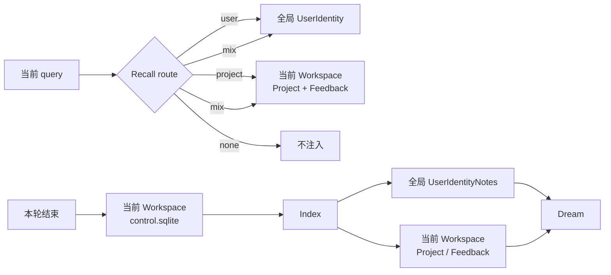
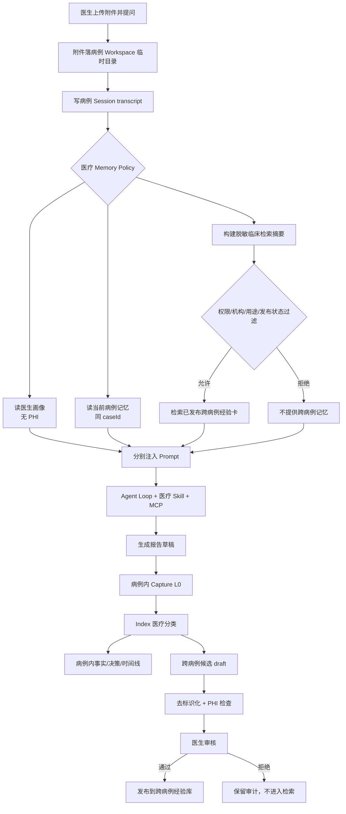

# PilotDeck 原版记忆与医疗跨病例长期记忆设计

> 文档状态：**现状说明 + 目标设计，跨病例部分尚未实现**  
> 适用项目：`med-pilotdeck`  
> 相关现状文档：[`memory-attachment-flow-guide.zh.md`](memory-attachment-flow-guide.zh.md)  
> 核心代码：`src/context/memory/`、`src/context/memory/edgeclaw-memory-core/`

本文用前后对比的方式说明：

1. PilotDeck 原版记忆系统如何从一次对话中读取、提炼和整理记忆；
2. 为什么不能直接把原版“项目记忆”改名为“患者记忆”后跨病例共享；
3. 面向医生/军医的跨病例长期记忆应该如何分层；
4. 哪些原有组件可以保留，哪些流程、目录、数据结构和安全策略必须改变。

---

## 1. 先说结论

PilotDeck 原版记忆适合“同一用户在多个办公项目中持续协作”：

```text
全局用户画像
+ 当前项目事实
+ 当前项目协作规则
+ 当前 Session 短期对话
```

医疗系统需要的不是简单的“跨项目记忆”，而是四类边界完全不同的信息：

```text
医生画像（不含患者信息）
+ 当前病例记忆（只能在本病例内读取）
+ 跨病例经验库（脱敏、审核后才能共享）
+ 医学知识库（指南、教材、SOP、战创伤语料）
```

其中最重要的原则是：

> **原始病历和当前病例事实不能作为全局 Memory 被其他病例自动召回。**

“跨病例长期记忆”应理解为：从历史病例中形成**脱敏、结构化、可追溯、经人工审核的经验卡片**，供相似病例检索参考；不能理解为让模型直接翻阅所有患者对话和报告。

---

## 2. 概念先分清

| 名称 | 含义 | 原版路径示例 |
|------|------|--------------|
| 附件 | DICOM、PDF、图片等原文件 | `<workspace>/.tmp/chat-attachments/` |
| Transcript | 完整会话流水，用于显示和恢复聊天 | `$PILOT_HOME/projects/<projectId>/chats/*.jsonl` |
| Tool Result | 过大、无法内联的工具结果 | `<workspace>/.pilotdeck/tool-results/<sessionId>/` |
| 短期记忆 | 当前 Session 中仍在上下文里的历史消息 | AgentSession 内存 + transcript |
| L0 | 本轮对话经清洗后的待整理草稿 | `memory/workspaces/<hash>/control.sqlite` |
| 文件型长期记忆 | Index 后生成的可读 Markdown | `UserIdentityNotes/`、`Project/`、`Feedback/` |
| 用户画像 | Dream 后汇总出的稳定用户信息 | `memory/global/UserIdentity/user-profile.md` |
| `MEMORY.md` | 文件型记忆清单和元信息索引 | `memory/workspaces/<hash>/memory/MEMORY.md` |

需要纠正两个常见误解：

1. `chats/*.jsonl` 是聊天记录，不是用户画像；
2. 普通工具结果会写入会话 JSONL；只有过大的工具结果才单独写入 `.pilotdeck/tool-results/`，JSONL 中保留引用。

---

## 3. 原版系统：一次带附件对话的完整流程

### 3.1 上传附件

附件先落在当前 Workspace 的临时目录：

```text
<workspace>/.tmp/chat-attachments/<批次id>/
```

这一阶段：

- 只保存附件原件；
- 不写长期记忆；
- 不把 DICOM、PDF 二进制放进 Memory；
- 前端拿到的是附件路径和诊断信息。

### 3.2 点击发送

发送给 Agent 的用户消息大致由三部分组成：

```text
用户自然语言 query
+ 附件绝对路径清单
+ Attachment diagnostics
```

例如 DICOM 不会直接以内联文本进入模型。模型先看到路径，再根据 Skill 调用医疗 MCP 工具读取。

同时，本轮用户输入立即追加到：

```text
$PILOT_HOME/projects/<projectId>/chats/<sessionId>.jsonl
```

这一步写的是 transcript，还没有生成正式长期记忆。

### 3.3 主模型调用前：Retrieve 读取旧记忆

记忆系统取当前查询和最近用户消息，进行长期记忆召回。

#### 第一步：LLM 决定读取范围

原版路由只有四种：

| Route | 读取内容 |
|-------|----------|
| `none` | 不注入长期记忆 |
| `user` | 只读全局用户画像 |
| `project` | 只读当前项目事实和协作规则 |
| `mix` | 同时读取用户画像和项目记忆 |

路由失败时默认返回 `none`，不会强行注入。

#### 第二步：确定项目

在普通项目 Workspace 中，`project` 就是当前 Workspace。

在 General 模式中，系统会：

1. 从多个历史项目的名称、描述和更新时间中构建 shortlist；
2. 默认最多提供约 30 个候选；
3. 让 LLM 选择最多一个最相关项目；
4. 再进入该项目的记忆清单。

#### 第三步：读取 Manifest 元信息

系统扫描的是文件型记忆清单，而不是把所有 Markdown 全部塞给模型。

清单元信息主要包括：

```text
relativePath
type
scope
projectId
description
updatedAt
```

`MEMORY.md` 是这类信息的人类可读索引页；运行时也会从文件记录构建 manifest。

#### 第四步：选择少量文件

LLM 根据 query 和 manifest 元信息选文件：

- 默认最多约 5 个；
- `user` 路由通常只取用户画像；
- 选择失败时，本地 fallback 对 `user` 取约 1 个，对其他路由取约 3 个；
- 单个文件读取也有行数限制，避免上下文失控。

#### 第五步：注入模型上下文

选中的记忆被包成：

```xml
<memory-context>
  ...召回的用户画像 / 项目事实 / Feedback...
</memory-context>
```

语义上这是受控的长期记忆上下文。当前 `MemoryAttachmentBuilder` 实际将它作为一条独立的 Canonical `user` 消息附加到 Prompt，而不是修改用户原始 query。

### 3.4 Agent Loop 处理附件

主模型此时看到：

```text
系统提示
+ 召回的旧记忆
+ 当前 Session 历史消息
+ 本轮用户 query 和附件路径
```

典型医学流程：

1. 读取 `med-medical` Skill；
2. 调用 `mcp__med-tools__med_parse_medical`；
3. 插件本地解析 PDF、DICOM、图片等；
4. 插件调用 G9-V-Med 生成报告；
5. assistant、tool call 和 tool result 持续写入 transcript；
6. 过大的 tool result 写入单独文件，transcript 保存引用。

这一阶段主要生成回答，仍不直接修改 `UserIdentity`、`Project` 或 `Feedback` 文件。

### 3.5 回合结束：Capture L0

Turn 结束时，`AgentLoop` 调用 `captureTurn`。

若 Profile 设置：

```yaml
memoryPolicy: disabled
```

则整轮跳过 Capture。

默认 `last_turn` 策略会提取本轮用户和之后的 assistant 文本，并清洗：

- tool call / tool result / 图片等非文本块；
- 已注入的旧 memory context；
- 插件状态脚手架；
- 不可信 sender metadata；
- 部分命令和运行噪声；
- 超出 `maxMessageChars` 的内容。

然后写入当前 Workspace 的：

```text
$PILOT_HOME/memory/workspaces/<hash>/control.sqlite
└── l0_sessions
    ├── session_key
    ├── messages_json
    ├── timestamp
    └── indexed = 0
```

L0 是“待整理草稿”，不是最终记忆。

### 3.6 Index：决定哪些内容值得长期保存

自动 Index 满足任一条件即可触发：

1. 待处理的用户对话段约 ≥ 20；
2. 有 pending L0，且距离 Index 锚点达到 `autoIndexIntervalMinutes`，默认 30 分钟；
3. 用户在 Memory UI 手动执行 Flush / Index。

流程：

1. 从 `control.sqlite` 读取 `indexed=0` 的 L0；
2. 找出其中新增的 user turn；
3. LLM 执行 `classifyMemoryTurn`；
4. `shouldStore=false`：不生成文件；
5. `shouldStore=true`：按 label 生成候选记忆；
6. 将 L0 标记为已 Index；
7. 重建 Manifest / `MEMORY.md`。

原版三种主要 label：

| Label | 原版含义 | 目录 |
|-------|----------|------|
| `user` | 稳定身份和背景 | `global/UserIdentityNotes/` |
| `project` | 项目事实、决策、进展、约束 | `workspaces/<hash>/memory/Project/` |
| `feedback` | 当前项目中的输出或协作规则 | `workspaces/<hash>/memory/Feedback/` |

例如：

```text
“请记住我是一名医生”
→ 可能进入 user

“这个项目的医学报告必须原样展示”
→ 更适合进入 feedback
```

附件二进制不会进入这些目录，完整医学报告通常仍保留在 transcript / tool-results 中。

### 3.7 Dream：整理和重写

自动 Dream 通常满足：

1. Index 后确实产生了文件变更；
2. 距离 Dream 锚点达到 `autoDreamIntervalMinutes`，默认 60 分钟；
3. 或用户手动触发 Dream。

Dream 会：

1. 先 Flush 未 Index 的 L0；
2. 聚类相似 `Project` 和 `Feedback`；
3. 合并重复文件，可能删除被吸收的旧文件；
4. 汇总 `UserIdentityNotes`；
5. 重写 `global/UserIdentity/user-profile.md`；
6. 重建 Manifest；
7. 保存 Dream 快照，支持回滚上一次 Dream。

因此原版记忆是三段慢流水线：

```text
Capture L0（立即）
  → Index（约 20 个待处理 turn / 约 30 分钟 / 手动）
  → Dream（有变更且约 60 分钟 / 手动）
```

---

## 4. 原版记忆的数据边界



原版边界可以概括为：

- `user`：跨项目共享；
- `project` / `feedback`：跟着当前 Workspace；
- Session 历史：只属于当前会话；
- 附件：属于文件系统，不属于 Memory。

---

## 5. 为什么原版不能直接用于跨病例

如果把“Workspace = 病例”，原版确实能自然实现**病例内记忆隔离**：

```text
病例 A Workspace → 病例 A 的 Project / Feedback
病例 B Workspace → 病例 B 的 Project / Feedback
```

但原版不具备安全的跨病例共享语义。

### 5.1 全局 `user` 不是患者画像

`global/UserIdentity` 设计用于保存操作者的稳定身份，例如医生专业、语言和长期角色。

如果把患者病情写进这里：

- 任何病例都可能召回；
- 容易发生患者 A 信息进入患者 B 回答；
- 无法满足最小必要原则；
- 删除单个病例时难以完整清除；
- Dream 还可能将多个病例信息合并进同一画像。

### 5.2 `project` 只知道“当前项目”，不知道临床权限

原版 Workspace 隔离是文件路径隔离，不等价于：

- 患者授权；
- 医生角色权限；
- 科室或机构边界；
- 数据用途；
- PHI 保留期；
- 病例撤回和删除传播。

### 5.3 原版 Retrieve 依赖概率性 LLM 路由

办公场景中偶尔选错项目通常只是回答不准；医疗场景中选错病例可能造成信息泄露或临床误导。

跨病例选择不能只依赖：

```text
query → LLM 选项目 → LLM 选文件
```

必须先经过确定性的权限、机构、状态、用途和去标识化过滤。

### 5.4 原版 Dream 会重写和删除

原版 Dream 允许合并、重写、删除被吸收的记忆文件，这适合整理办公知识。

临床事实需要：

- 原始来源不可变；
- 修改有版本；
- 冲突并列保留；
- 删除使用 tombstone / 撤回状态；
- 能追溯到病例、附件、报告和审核人。

不能让 LLM 无审计地“整理掉”关键临床差异。

---

## 6. 医疗目标：四层记忆模型

### 6.1 第一层：Session 短期上下文

用途：

- 当前对话连续性；
- 当前工具调用结果；
- 当前报告生成过程。

沿用原版 Session 和 transcript，不跨 Session 自动共享。

### 6.2 第二层：当前病例记忆

仅在同一病例 Workspace 内可见，建议细分为：

| 类型 | 示例 |
|------|------|
| `case_fact` | 伤情、检查发现、既往史、过敏史 |
| `case_decision` | 已确认的临床决策及依据 |
| `case_timeline` | 事件与处置时间线 |
| `case_uncertainty` | 尚未确认、存在冲突的信息 |
| `workflow_feedback` | 本病例报告格式和协作要求 |

这是原版 `Project / Feedback` 的医疗化替代，但必须增加来源、版本和确认状态。

### 6.3 第三层：医生画像

只保存不含患者信息的稳定偏好：

- 专业和岗位；
- 常用语言；
- 报告结构偏好；
- 是否需要术语解释；
- 个人可访问的功能范围。

可以继续使用 `global/UserIdentity`，但写入前必须经过 PHI 检测。

### 6.4 第四层：跨病例经验库

跨病例经验不是历史病历全文，而是审核后的“病例经验卡”：

```text
去标识化临床特征
+ 关键处置路径
+ 结果与复盘
+ 适用边界
+ 来源和审核信息
```

它应当具有：

- 去标识化；
- 人工审核；
- 发布状态；
- 来源可追溯；
- 机构/科室访问范围；
- 明确“仅作历史参考，不是当前患者证据”；
- 可撤回和重新索引。

医学指南、教材、SOP 和战创伤书籍仍应进入独立 RAG，不应混进病例经验库。

---

## 7. 推荐目标架构

为尽量少改 PilotDeck 内核，推荐：

```text
原版 EdgeClaw Memory
├── 医生画像：继续使用 global/UserIdentity
└── 当前病例：继续复用 workspace 隔离、L0、Index 的基础设施

新增 Clinical Case Memory
└── 通过本地 MCP / RAG 管理跨病例经验卡
    ├── 候选生成
    ├── 去标识化
    ├── 人工审核
    ├── 发布/撤回
    ├── 检索
    └── 审计
```

这样无需把“跨病例”强塞进全局用户画像，也不必立即重写整个 EdgeClaw。

### 7.1 建议目录

```text
$PILOT_HOME/
├── memory/
│   ├── global/
│   │   └── UserIdentity/                     # 医生画像，不含 PHI
│   └── workspaces/<caseHash>/
│       ├── control.sqlite                    # 当前病例 L0
│       └── memory/
│           ├── CaseFacts/
│           ├── CaseDecisions/
│           ├── CaseTimeline/
│           ├── CaseUncertainty/
│           └── WorkflowFeedback/
│
└── clinical-memory/
    ├── control.sqlite                        # 候选、审核、发布、撤回、审计
    ├── cards/
    │   ├── draft/
    │   ├── published/
    │   └── withdrawn/
    ├── index/
    │   ├── metadata.jsonl
    │   └── embeddings.npy                    # 可选，本地 embedding
    └── manifests/
        └── CLINICAL_MEMORY.md
```

跨病例经验库也可以放在医疗插件的数据根下。关键不在具体目录，而在于它必须与普通 `global/UserIdentity` 分开。

---

## 8. 改造后的 Retrieve

原版：

```text
none / user / project / mix
```

医疗版建议变成：

```text
none
clinician
case
cross_case
clinical_knowledge
mix
```

### 8.1 先做确定性安全过滤

在调用 LLM 判断相关性之前，先校验：

1. 当前用户身份和角色；
2. 当前机构 / 科室；
3. 当前 `caseId`；
4. 数据用途；
5. 记忆是否 `published`；
6. 是否已撤回或过期；
7. 是否完成去标识化；
8. 是否允许当前角色访问；
9. 是否允许用于本次任务。

没有通过过滤的数据不能进入 shortlist，LLM 根本看不到其元信息。

### 8.2 不直接使用原始用户消息检索跨病例

原始 query 可能包含：

- 患者姓名；
- 住院号；
- 附件绝对路径；
- 联系方式；
- 其他病例标识。

跨病例检索前应生成一个受控的临床检索摘要，例如：

```json
{
  "task": "war_trauma_plan",
  "age_band": "adult",
  "mechanism": ["blast", "penetrating"],
  "body_regions": ["thorax"],
  "severity": "high",
  "confirmed_findings": ["left pneumothorax"],
  "exclude_identifiers": true
}
```

检索摘要只使用最小必要特征，不携带姓名、精确地址、附件路径和未经确认的信息。

### 8.3 分开注入“当前证据”和“历史经验”

建议 Prompt 中显式分区：

```xml
<current-case-evidence>
  当前患者附件、检查结果和已确认事实
</current-case-evidence>

<cross-case-memory>
  去标识化历史经验，仅供参考，不得当作当前患者事实
</cross-case-memory>

<clinical-knowledge>
  指南、教材、SOP、战创伤 RAG 证据
</clinical-knowledge>
```

模型必须遵守：

- 当前病例证据优先；
- 跨病例经验不能证明当前患者存在同样情况；
- 跨病例内容必须带来源卡片 ID；
- 出现冲突时不得自行合并成确定事实。

---

## 9. 改造后的 Capture、Index 和发布流程

### 9.1 Capture：仍写病例内 L0

本轮结束后仍可复用原版 `captureTurn`，但增加：

```text
tenantId
organizationId
caseId
encounterId
operatorId
purpose
dataClassification
sourceAttachmentHashes
```

Capture 只写当前病例 Workspace，不自动写跨病例库。

### 9.2 Index：改为医疗分类

原版：

```text
user / project / feedback
```

医疗版建议：

```text
clinician_preference
case_fact
case_decision
case_timeline
case_uncertainty
workflow_feedback
cross_case_candidate
discard
```

每条病例事实还应包含：

- `verificationStatus`：未确认 / 模型提取 / 医生确认；
- `sourceType`：附件、用户输入、工具结果、医生修改；
- `sourceRefs`：附件 hash、报告 ID、transcript event ID；
- `effectiveAt`：事实发生时间；
- `supersedes`：替代哪一版本；
- `confidence`：模型置信和人工确认状态分开记录。

### 9.3 跨病例候选不能自动发布

当 Index 判断内容可能具有跨病例价值时，只生成：

```text
status = draft
type = cross_case_candidate
```

随后必须经过：

1. 去标识化；
2. PHI 扫描；
3. 临床人员审核；
4. 适用边界填写；
5. 来源检查；
6. 发布签名。

只有 `published` 卡片可以被其他病例 Retrieve。

### 9.4 建议的病例经验卡

```yaml
id: cm_case_01J...
status: published
organization_id: hospital-a
scope: trauma-team
source_case_ref: hmac:...
source_case_version: 3
deidentification_version: deid-v2
review:
  reviewer_id: user:...
  reviewed_at: 2026-08-17T10:00:00Z
clinical_features:
  age_band: adult
  mechanism: [blast, penetrating]
  body_regions: [thorax]
  severity: high
summary: ...
interventions:
  - action: ...
    rationale: ...
outcome: ...
lessons:
  - ...
limitations:
  - 仅适用于……
provenance:
  attachment_hashes: [...]
  report_ids: [...]
  model_id: G9-V-Med
  skill_version: med-trauma-stage-plan@...
```

跨病例检索只暴露允许进入 Prompt 的字段，不把内部 `source_case_ref` 或原始附件路径暴露给模型。

---

## 10. 医疗版 Dream 应如何改变

原版 Dream 的“聚类、合并、重写、删除”不能原样用于临床事实。

### 10.1 可以继续自动整理的内容

- 医生非 PHI 偏好；
- 重复的工作流 Feedback；
- 已发布病例卡的主题索引；
- 同义标签和检索关键词；
- 统计性经验摘要。

### 10.2 不允许自动覆盖的内容

- 已确认病例事实；
- 已签核临床决策；
- 处置时间线；
- 审核记录；
- 来源与附件 hash；
- 已发布病例经验卡原文。

### 10.3 从“覆盖重写”改成“版本化整理”

医疗 Dream 应：

```text
读取已发布卡片
→ 生成新的聚类或总结版本
→ 保留成员卡片 ID 和来源
→ 人工审核后发布新版本
→ 旧版本标记 superseded
→ 不物理删除审计链
```

撤回病例时：

1. 将相关经验卡标记为 `withdrawn`；
2. 从检索索引移除；
3. 重建 manifest / embedding；
4. 保留最小审计 tombstone；
5. 禁止后续 Retrieve。

---

## 11. 原版与医疗版对比

| 维度 | PilotDeck 原版 | 医疗跨病例目标 |
|------|----------------|----------------|
| Workspace | 办公项目 | 单病例 / 单医疗任务 |
| 全局记忆 | 用户画像 | 医生画像，禁止 PHI |
| 项目记忆 | Project / Feedback | CaseFacts / Decisions / Timeline / Uncertainty |
| 跨项目读取 | General 模式可选一个项目 | 原始病例禁止跨读 |
| 跨病例经验 | 无专门概念 | 去标识化、审核发布的 Case Memory Card |
| Retrieve 入口 | 原始 query + 最近消息 | 受控临床摘要 + 确定性权限过滤 |
| 路由 | LLM：none/user/project/mix | 安全策略先行，再做 clinician/case/cross_case/knowledge |
| Index | LLM 自动决定是否写文件 | LLM 提取 + 来源/确认状态 + 跨病例候选待审核 |
| Dream | 可聚类、覆盖、删除 | 临床事实不可覆盖；总结必须版本化 |
| 删除 | 可删除被合并文件 | 撤回、tombstone、索引清除、保留审计 |
| 证据 | source session/path 为主 | 附件 hash、报告、模型、Skill、审核人完整溯源 |
| 降级 | 失败可少取文件或不注入 | 权限/去标识化失败必须 fail-closed |

---

## 12. 需要改哪些地方

### 12.1 尽量保留

| 组件 | 保留内容 |
|------|----------|
| `AgentLoop` | Turn 完成后调用 Capture 的时机 |
| `MemoryResolver` | Retrieve / Capture 抽象 |
| `MemoryAttachmentBuilder` | 将召回内容注入 Prompt 的机制 |
| `control.sqlite` | L0、pipeline state、trace 基础 |
| Heartbeat / Index 调度 | 批处理、时间阈值、手动 Flush |
| Manifest | 先看元信息、再读取少量正文的思路 |
| Dream snapshot | 可回滚思想 |
| Workspace hash 隔离 | 病例内存储边界基础 |

### 12.2 需要修改

| 位置 | 改造 |
|------|------|
| `src/context/memory/MemoryResolver.ts` | 增加医疗检索上下文：case、operator、purpose、tenant |
| `MemoryAttachmentBuilder.ts` | 分开注入 clinician / current-case / cross-case / knowledge |
| `edgeclaw-memory-core/core/types.ts` | 增加病例类型、确认状态、来源、审核和版本字段 |
| `core/pipeline/heartbeat.ts` | 医疗分类、病例内 Index、跨病例 draft 候选 |
| `core/retrieval/reasoning-loop.ts` | LLM 前增加确定性权限过滤；禁止直接跨病例项目选择 |
| `core/review/dream-review.ts` | 临床事实改为不可变版本，禁止无审计覆盖删除 |
| Profile | 医疗场景指定 Memory policy 和允许的召回 scope |
| Permission / Audit | 跨病例检索、发布、撤回必须记录审计 |

### 12.3 建议新增

为减少核心侵入，建议新增本地 `clinical-memory` MCP：

```text
clinical_memory_search
clinical_memory_create_candidate
clinical_memory_review
clinical_memory_publish
clinical_memory_withdraw
clinical_memory_status
```

该 MCP 负责跨病例经验库；普通 EdgeClaw 继续负责医生画像和当前病例记忆。

---

## 13. 推荐的新端到端流程



---

## 14. 分阶段落地建议

### Phase 0：先保证不串病例

- 每个病例独立 Workspace；
- 医疗 Profile 默认 `memoryPolicy: disabled`，或仅允许病例内记忆；
- 关闭 General 模式跨项目 Recall；
- 全局 `UserIdentity` 增加 PHI 拦截；
- 对已有全局画像执行 PHI 清查。

### Phase 1：病例内长期记忆

- 将 `Project / Feedback` 映射为病例内分类；
- 增加 `caseId`、来源、确认状态和版本；
- Retrieve 只允许当前 `caseId`；
- 报告和附件仍保留在 transcript / artifact，不整篇写入 Memory。

### Phase 2：跨病例候选与审核

- 新增 Clinical Memory MCP；
- 从已签核病例生成 draft 经验卡；
- 接入本地去标识化和 PHI 检查；
- 增加人工审核、发布、撤回状态；
- 记录完整审计。

### Phase 3：跨病例检索

- 本地 metadata + embedding 混合检索；
- 先权限过滤，再相似度排序；
- Prompt 中分离当前证据和历史经验；
- 显示卡片来源、适用边界和审核状态；
- 无可靠结果时明确返回“无可用跨病例经验”，不静默扩大检索范围。

### Phase 4：版本化 Dream

- 只整理已发布卡片的索引和主题；
- 聚类结果保留全部 provenance；
- 新总结需审核后发布；
- 支持撤回传播、重建索引和审计回滚。

---

## 15. 验收标准

### 隔离

- 病例 A 的原始对话、附件、病例事实不会在病例 B 中召回；
- 更换 `caseId` 后，当前病例 Memory 必须为空或属于新病例；
- General 模式无法绕过病例隔离。

### 跨病例

- 只有 `published` 且通过权限过滤的脱敏经验卡可检索；
- 模型看到历史卡片时，明确知道它不是当前病例事实；
- 每条跨病例结论都能回溯 card ID 和审核记录。

### 数据治理

- 姓名、住院号、联系方式、附件路径不会进入跨病例索引；
- 病例撤回后，相关卡片不能再被召回；
- 所有发布、修改、撤回都有操作者和时间戳。

### 可靠性

- LLM 路由失败时不跨病例召回；
- 去标识化失败时不发布；
- embedding 不可用时不得静默改为全库模糊检索；
- Memory 故障不应阻断当前病例的基础诊疗流程，但必须显示降级状态。

---

## 16. 一句话总结

原版 PilotDeck 的记忆链路是：

```text
当前 query 召回用户/项目旧记忆
→ Agent 对话
→ Capture L0
→ Index 写 User / Project / Feedback
→ Dream 合并并重写画像
```

医疗跨病例版本应改为：

```text
医生画像与当前病例严格隔离
→ 当前病例只读自己的事实
→ 历史病例只能生成脱敏候选
→ 人工审核后发布为跨病例经验卡
→ 权限过滤后检索
→ 与当前病例证据分区注入
→ 全程保留来源、版本、审核和撤回能力
```

核心变化不是“多读几个 Workspace”，而是把原版自动化的办公记忆，改造成**病例内隔离、跨病例受控发布、证据可追溯、临床人员最终负责**的医疗记忆体系。

---

## 17. 相关代码索引

| 主题 | 路径 |
|------|------|
| Memory 接口 | `src/context/memory/MemoryResolver.ts` |
| Prompt 注入 | `src/context/memory/MemoryAttachmentBuilder.ts` |
| Provider 适配 | `src/context/memory/EdgeClawMemoryProvider.ts` |
| 配置创建 | `src/context/memory/createEdgeClawMemoryProviderFromConfig.ts` |
| 消息清洗 | `src/context/memory/edgeclaw-memory-core/src/message-utils.ts` |
| Retrieve | `src/context/memory/edgeclaw-memory-core/src/core/retrieval/reasoning-loop.ts` |
| LLM 分类和选择 | `src/context/memory/edgeclaw-memory-core/src/core/skills/llm-extraction.ts` |
| Index | `src/context/memory/edgeclaw-memory-core/src/core/pipeline/heartbeat.ts` |
| Dream | `src/context/memory/edgeclaw-memory-core/src/core/review/dream-review.ts` |
| SQLite / Snapshot | `src/context/memory/edgeclaw-memory-core/src/core/storage/sqlite.ts` |
| 文件型 Memory | `src/context/memory/edgeclaw-memory-core/src/core/file-memory.ts` |
| Agent Capture 时机 | `src/agent/loop/AgentLoop.ts` |
