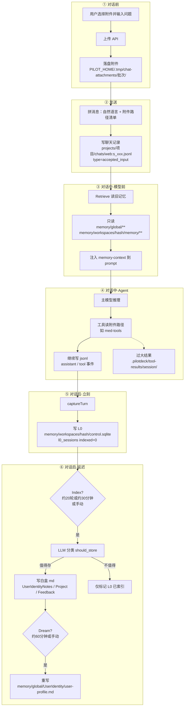

# PilotDeck 记忆系统入门：用户带附件提问时，后台到底发生了什么？

> 面向完全不了解本系统的新手。  
> 本文用「一次带附件的提问」把前前后后说清楚，并标出**真实文件路径**。  
>  
> 下文默认你的本机部署是：  
> - 项目根目录：`/Users/william/Downloads/PilotDeck`  
> - 运行时家目录（`PILOT_HOME`）：`/Users/william/Downloads/PilotDeck/.pilotdeck-home`  
>  
> 如果你换机器或改了 `PILOT_HOME`，请把路径里的这段前缀换成你自己的。

---

## 0. 先建立三个最重要的直觉

### 直觉 1：前端看到的「聊天」，不是「记忆」

| 你在前端看到的 | 实际存哪里 | 是什么 |
|----------------|------------|--------|
| 左侧会话列表、聊天气泡 | `projects/.../chats/*.jsonl` | **对话记录（transcript）**，完整流水 |
| 设置/记忆面板里的用户画像、项目记忆 | `memory/**` | **白盒记忆**，提炼后的长期知识 |

两者相关，但**不是同一份文件**。  
聊了很多轮，对话记录一定在涨；用户画像却可能还是空的——这很正常。

### 直觉 2：带附件时，文件本体和「记忆」是分开的

- DICOM / PDF / 图片等：**先存到磁盘临时目录**，Agent 用工具去读。  
- 记忆系统：**几乎只处理文字**（用户说了什么、助手回复了什么的摘要）。  
- **附件二进制不会被存进记忆库。**

### 直觉 3：记忆是「三层慢动作」，不是「聊完立刻改画像」

```text
立刻     → 写聊天记录 jsonl + 写 L0 缓冲（SQLite）
大约 30 分钟或积满约 20 轮 → Index：决定要不要写成可读的记忆文件
大约 60 分钟且已有新文件   → Dream：整理、合并、重写用户画像
```

---

## 1. 你的电脑上，相关目录长什么样？

### 1.1 总图（请按这个地图找文件）

```text
/Users/william/Downloads/PilotDeck/                          ← 代码仓库根目录
├── src/                                                     ← 引擎源码（含记忆实现）
├── ui/                                                      ← 前端 + Web 服务
├── plugins/med-tools/                                       ← 医学附件解析插件
├── skills/                                                  ← 内置技能说明
├── scripts/start-local.sh                                   ← 启动脚本
│
└── .pilotdeck-home/                                         ← ★ 运行时家目录 PILOT_HOME
    ├── pilotdeck.yaml                                       ← 主配置（模型、路由、Cron…）
    ├── auth.db                                              ← Web 登录/会话名等
    ├── server-token                                         ← Gateway 令牌
    │
    ├── projects/                                            ← ★ 前端对话记录在这里
    │   └── <projectId>/
    │       ├── .cwd                                         ← 可选：真实项目路径
    │       └── chats/
    │           ├── web:s_<uuid>.jsonl                       ← 一条会话 = 一个文件
    │           └── web:s_<uuid>/
    │               └── subagents/<id>.jsonl                 ← 子 Agent 对话
    │
    ├── memory/                                              ← ★ 白盒记忆在这里
    │   ├── global/
    │   │   ├── UserIdentity/user-profile.md                 ← 用户画像（Dream 后才有）
    │   │   └── UserIdentityNotes/*.md                       ← 用户事实笔记（Index 后）
    │   └── workspaces/
    │       └── <hash10>/                                    ← 每个项目工作区一个哈希目录
    │           ├── control.sqlite                           ← L0 缓冲 + 流水线状态
    │           └── memory/
    │               ├── MEMORY.md                            ← 自动索引清单（不是聊天记录）
    │               ├── project.meta.md                      ← 项目元信息
    │               ├── Project/*.md                         ← 项目事实记忆
    │               ├── Feedback/*.md                        ← 协作/输出规则记忆
    │               └── GeneralProjects/*.md                 ← 仅 General 聊天模式
    │
    ├── .tmp/chat-attachments/<批次id>/                      ← ★ 上传附件本体
    ├── .pilotdeck/tool-results/<sessionId>/                 ← 过大的工具返回内容
    ├── plugins/                                             ← 运行时插件链接（如 med-tools）
    ├── skills/                                              ← 用户级技能
    ├── cron/                                                ← 定时任务
    ├── router/                                              ← 路由统计（若开启）
    └── logs/                                                ← 日志
```

### 1.2 用你机器上的真实例子对照

**运行时家目录：**

```text
/Users/william/Downloads/PilotDeck/.pilotdeck-home/
```

**某次本机会话（示例）：**

```text
/Users/william/Downloads/PilotDeck/.pilotdeck-home/projects/Users-william-Downloads-PilotDeck-.pilotdeck-home/chats/web:s_f0b051f4-4962-467b-ab03-d6eeb7587882.jsonl
```

**从 Linux 迁过来的旧会话（示例）：**

```text
/Users/william/Downloads/PilotDeck/.pilotdeck-home/projects/home-huojianfan-.pilotdeck/chats/web:s_f08837e2-fb01-4278-960e-302a1d7c9364.jsonl
```

**记忆工作区（示例，hash 因项目路径而异）：**

```text
/Users/william/Downloads/PilotDeck/.pilotdeck-home/memory/workspaces/055e82603c/control.sqlite
/Users/william/Downloads/PilotDeck/.pilotdeck-home/memory/workspaces/6050e93989/memory/MEMORY.md
/Users/william/Downloads/PilotDeck/.pilotdeck-home/memory/global/UserIdentity/
/Users/william/Downloads/PilotDeck/.pilotdeck-home/memory/global/UserIdentityNotes/
```

**上传附件目录（示例）：**

```text
/Users/william/Downloads/PilotDeck/.pilotdeck-home/.tmp/chat-attachments/1786433240151-33fb71a3/
```

> 说明：如果你聊天时绑定的是「某个真实业务项目目录」（不是 `.pilotdeck-home` 本身），附件也可能落在**那个项目目录**下的 `.tmp/chat-attachments/`。Web 上传逻辑是：`{当前项目根}/.tmp/chat-attachments/...`。

### 1.3 `projectId` 和 `hash` 是什么？

- **`projectId`**（对话目录名）：由项目路径“slug 化”得到，例如  
  `/Users/william/Downloads/PilotDeck/.pilotdeck-home`  
  → `Users-william-Downloads-PilotDeck-.pilotdeck-home`
- **记忆 workspace hash**：对项目绝对路径做 SHA1，取前 10 位十六进制，例如 `055e82603c`  
  不同项目路径 → 不同 hash → **项目记忆互相隔离**  
  用户画像在 `memory/global/`，**跨项目共享**

---

## 2. 记忆到底分成哪几种？（给新手的分类表）

可以把系统想成一个「图书馆」：

| 名称 | 白话解释 | 典型路径 | 什么时候出现 |
|------|----------|----------|--------------|
| **对话记录 jsonl** | 完整聊天录像带 | `.../projects/.../chats/web:s_*.jsonl` | 每发一轮立刻追加 |
| **L0 缓冲** | 待整理的草稿纸 | `.../memory/workspaces/<hash>/control.sqlite` 表 `l0_sessions` | 每轮结束立刻写入 |
| **user notes** | 「关于你」的单条便签 | `.../memory/global/UserIdentityNotes/*.md` | Index 认为该记「用户是谁」时 |
| **user 画像** | 汇总后的人物档案 | `.../memory/global/UserIdentity/user-profile.md` | Dream 整理 notes 后 |
| **project 记忆** | 「这个项目里」的事实 | `.../workspaces/<hash>/memory/Project/*.md` | Index 认为该记项目事实时 |
| **feedback 记忆** | 「这个项目里」的规矩 | `.../workspaces/<hash>/memory/Feedback/*.md` | Index 认为该记输出/协作规则时 |
| **project.meta** | 项目名片 | `.../memory/project.meta.md` | 有项目记忆时维护 |
| **MEMORY.md** | 记忆目录的自动目录页 | `.../memory/MEMORY.md` | 写记忆文件后自动更新 |
| **附件原件** | 你上传的文件本身 | `.../.tmp/chat-attachments/<批次>/` | 上传时 |
| **大工具结果** | 太长塞不进气泡的工具输出 | `.../.pilotdeck/tool-results/<sessionId>/` | 工具返回过大时 |

**user vs feedback 怎么分（口诀）：**

- 「我是谁 / 我长期怎样」→ **user**（全局）  
- 「这个项目交付时必须怎样」→ **feedback**（跟项目走）  
  例：「医学报告必须原样展示」→ feedback，不是 user。

---

## 3. 一次「带附件提问」的完整故事（按时间顺序）

下面用最白话的方式，把**对话前 / 对话中 / 对话后**逐步拆开。

### 3.1 对话前：你上传附件

**你做了什么：** 在网页里点回形针，选 `.dcm` / `.pdf` / 图片等，再输入问题。

**系统做了什么：**

1. 浏览器把文件 POST 到 Web 服务：  
   `POST /api/projects/<项目名>/upload-attachments`
2. 服务端把文件落到磁盘（单文件上限约 64MB，最多约 64 个）：

```text
{当前项目根}/.tmp/chat-attachments/{时间戳}-{随机码}/
    ├── 1-某某.dcm
    ├── 2-某某.pdf
    └── ...
```

在你当前这种「项目根就是 `.pilotdeck-home`」的情况下，常见路径是：

```text
/Users/william/Downloads/PilotDeck/.pilotdeck-home/.tmp/chat-attachments/<批次id>/
```

3. **这一步不写记忆。**  
   不写 `memory/`，不写 L0，只是把文件放好，把**绝对路径**返回给前端。

---

### 3.2 对话前→中：你点发送

**前端会把消息拼成一大段文字**，大致包括：

1. 你的自然语言问题（例如：「帮我分析这个 DICOM」）  
2. 一段「附件清单脚手架」，类似：

```text
[Files attached by user and available for reading in the project:]
- xxx.dcm (...): /绝对路径/.../xxx.dcm
...
[End files attached by user]

[Attachment diagnostics]
- File extension .dcm is not in the inline text whitelist; skipped.
...
```

含义：

- 模型**不会**在消息里直接看到 DICOM 像素；  
- 它只看到「有这些路径」；  
- 需要自己再调工具去读这些路径。

**然后 Gateway 开始这一轮 turn**，立刻把用户消息写入对话记录：

```text
.../projects/<projectId>/chats/web:s_<uuid>.jsonl
```

这一行事件的类型通常是：

```json
{"type":"accepted_input", "sessionId":"web:s_...", "messages":[...], ...}
```

**注意：** 这是聊天记录，**还不是**用户画像。

---

### 3.3 对话中 · 模型真正开始想之前：Retrieve（读旧记忆）

在调用大模型之前，系统会做一次「要不要带上以前的记忆」：

1. 取出「最近一条用户消息」当检索 query（里面可能含附件路径文字）  
2. 用 LLM 做路由 gate：`none` / `user` / `project` / `mix`  
3. 如果决定要用记忆，就从磁盘读已有文件，例如：  
   - `.../memory/global/UserIdentity/user-profile.md`  
   - `.../memory/workspaces/<hash>/memory/Project/*.md`  
   - `.../Feedback/*.md`  
4. 把选中的内容包进 system 侧的 memory-context，再送给主模型  

**关键点：**

- Retrieve **只读旧记忆**，不会在这一步把本次附件内容写进记忆库。  
- 如果你本地 `UserIdentity/` 还是空目录、`Project/` 也没有实质条目，这一步几乎什么都注不进去——所以新账号/新环境会感觉「记忆没起作用」。

**相关源码位置（想深入看代码时）：**

```text
/Users/william/Downloads/PilotDeck/src/context/DefaultContextRuntime.ts
/Users/william/Downloads/PilotDeck/src/context/memory/MemoryAttachmentBuilder.ts
/Users/william/Downloads/PilotDeck/src/context/memory/EdgeClawMemoryProvider.ts
/Users/william/Downloads/PilotDeck/src/context/memory/edgeclaw-memory-core/src/core/retrieval/reasoning-loop.ts
```

---

### 3.4 对话中：Agent 循环（处理附件，但仍不写白盒记忆）

主模型（你当前配置一般是 `openai/gpt-5.5`）看到：

- 系统提示（可能含旧记忆）  
- 历史对话  
- 本轮用户消息（含附件路径清单）

然后它可能：

1. 读取医学技能说明（skill）  
2. 调用 MCP 工具，例如：  
   - `mcp__med-tools__med_tools_health`  
   - `mcp__med-tools__med_parse_medical`（路径指向刚才那个 attachments 目录）  
3. 医学插件在本地解析 DICOM，并可能调用 G9-V-Med（失败则回退 GPT-5.5）生成报告  
4. 把工具结果、助手回复不断追加到**同一个 jsonl**

**落盘位置：**

| 内容 | 路径 |
|------|------|
| 普通回复 / 小工具结果 | `.../chats/web:s_*.jsonl` 内的 `assistant_message` / `tool_result_message` |
| 过大的工具结果 | `.../.pilotdeck/tool-results/<sessionId>/...json`，jsonl 里只留引用（`durable_message` / `tool_result_reference`） |
| 子 Agent | `.../chats/web:s_<uuid>/subagents/<id>.jsonl` |

**医学插件代码位置：**

```text
/Users/william/Downloads/PilotDeck/plugins/med-tools/
/Users/william/Downloads/PilotDeck/.pilotdeck-home/plugins/med-tools   ← 通常是指向上面的符号链接
```

**这一阶段仍然：不直接写 `UserIdentity` / `Project` / `Feedback` 这些白盒记忆文件。**

---

### 3.5 对话后 · 立刻：Capture L0（写草稿纸）

当这一轮 turn 结束（成功或失败，系统都会尽量做）：

1. `AgentLoop` 调用 `context.captureTurn`  
2. 记忆服务默认用策略 `last_turn`：只抓「本轮用户 + 本轮之后的助手文本」  
3. 做清洗（去掉部分噪声；带 tool_call 的 assistant 块通常不进 L0）  
4. 写入当前工作区的 SQLite：

```text
/Users/william/Downloads/PilotDeck/.pilotdeck-home/memory/workspaces/<hash>/control.sqlite
```

表名：`l0_sessions`  
关键字段概念：

- `session_key`：如 `web:s_...`  
- `messages_json`：规范化后的消息快照  
- `indexed`：`0` 表示还没被 Index 处理  

同时，Gateway 的 `afterTurnCompleted` 会安排一次记忆维护调度；UI 侧还有大约每 60 秒的定时检查。

**此时状态：**

- ✅ 聊天记录完整（jsonl）  
- ✅ L0 草稿纸有了  
- ❌ 用户画像文件通常还没变  

**相关源码：**

```text
/Users/william/Downloads/PilotDeck/src/agent/loop/AgentLoop.ts
/Users/william/Downloads/PilotDeck/src/context/memory/edgeclaw-memory-core/src/message-utils.ts
/Users/william/Downloads/PilotDeck/src/context/memory/edgeclaw-memory-core/src/core/pipeline/heartbeat.ts
/Users/william/Downloads/PilotDeck/src/cli/createLocalGateway.ts   ← afterTurnCompleted / scheduleMemoryMaintenance
```

---

### 3.6 对话后 · 延迟：Index（决定要不要写成正式记忆）

**触发条件（满足其一即可）：**

- 待处理的 L0「对话段」大约 ≥ **20**；或  
- 有 pending，且距离上次 Index 锚点 ≥ **`autoIndexIntervalMinutes`（默认 30 分钟）**；或  
- 你在 UI 记忆面板手动点 Flush / Index  

**Index 做什么：**

1. 从 `control.sqlite` 读 `indexed=0` 的 L0  
2. 对每个新增的 **user turn**，让 LLM 分类（`classifyMemoryTurn`）：  
   - `should_store=false` → **不写文件**（寒暄、一次性「帮我看这个片子」很常见）  
   - `should_store=true` + labels → 按标签落盘：

| label | 写入路径 |
|-------|----------|
| `user` | `.../memory/global/UserIdentityNotes/<名字>-<hash>.md` |
| `project` | `.../memory/workspaces/<hash>/memory/Project/<名字>-<hash>.md` |
| `feedback` | `.../memory/workspaces/<hash>/memory/Feedback/<名字>-<hash>.md` |

3. 无论写没写文件，这笔 L0 一般会标成已索引（避免反复处理）  
4. 更新 `MEMORY.md` 这类索引页  

**带附件问诊的典型结果：**

- 「帮我分析这些超声」→ 多半 **不入库**（一次性任务）  
- 「请记住：我是放射科医生，报告必须原样展示」→ 可能分别进入 **user notes** 和 **feedback**  

医学报告全文通常留在 **jsonl / tool-results**，方便续聊；默认**不会**整篇变成用户画像。

**相关源码：**

```text
/Users/william/Downloads/PilotDeck/src/context/memory/edgeclaw-memory-core/src/core/skills/llm-extraction.ts
/Users/william/Downloads/PilotDeck/src/context/memory/edgeclaw-memory-core/src/core/pipeline/heartbeat.ts
/Users/william/Downloads/PilotDeck/src/context/memory/edgeclaw-memory-core/src/service.ts
```

---

### 3.7 对话后 · 更晚：Dream（整理书架、重写画像）

**触发条件：**

- Index 之后确实产生了新的记忆文件；并且  
- 距离上次 Dream ≥ **`autoDreamIntervalMinutes`（默认 60 分钟）**；或  
- 手动在 UI 点 Dream  

**Dream 做什么：**

1. 先 flush 还没 Index 完的 L0  
2. 聚类、合并过多的 `Project/`、`Feedback/` 文件  
3. 读取 `UserIdentityNotes/`，用 LLM 重写：

```text
.../memory/global/UserIdentity/user-profile.md
```

4. 吸收进画像后的 notes 可能被删除  
5. 重建 `MEMORY.md`  
6. 留快照，支持「回滚上一次 Dream」  

**如果你本地还没有任何 Notes / Project / Feedback 文件：**  
Dream 会变成 **No-op**（成功但啥也没改）——这正是「聊了几轮画像还是空」的常见原因。

**相关源码：**

```text
/Users/william/Downloads/PilotDeck/src/context/memory/edgeclaw-memory-core/src/core/review/dream-review.ts
```

---

## 4. 总流程图（建议对照着看）



---

## 5. 「什么进什么、什么不进」对照表

| 内容 | 进 jsonl 聊天？ | 进 L0？ | 进白盒 md？ |
|------|-----------------|---------|-------------|
| 用户自然语言问题 | 是 | 是（规范化后） | 仅当 Index 判定值得长期记 |
| 附件绝对路径清单文字 | 是（脚手架） | 可能残留在 user 文本里 | 通常不会单独变成记忆文件 |
| DICOM / PDF 二进制本体 | 否（只存路径） | 否 | 否 |
| 工具生成的医学报告 | 是（或 tool-results 引用） | assistant 文本可能进 L0 | 极少整篇入库 |
| 历史用户画像 | 否 | 否 | Retrieve 时只读注入 prompt |
| 「请记住我是…」这类明确偏好 | 是 | 是 | 较容易在 Index 后入库 |

---

## 6. 配置里和记忆有关的旋钮

配置文件：

```text
/Users/william/Downloads/PilotDeck/.pilotdeck-home/pilotdeck.yaml
```

如果你的 yaml **没有写 `memory:` 段**，系统会用默认值（相当于开启记忆）。常见项：

| 配置项 | 默认（概念上） | 作用 |
|--------|----------------|------|
| `memory.enabled` | true | 总开关 |
| `memory.captureStrategy` | `last_turn` | L0 抓本轮还是全会话 |
| `memory.autoIndexIntervalMinutes` | 30 | Index 时间阈值；0 表示关掉时间触发 |
| `memory.autoDreamIntervalMinutes` | 60 | Dream 时间阈值 |
| `memory.heartbeatBatchSize` | 30 | 每批 Index 处理多少会话 |
| `memory.maxMessageChars` | 6000 | 单条消息截断长度 |
| `memory.model` | 跟随主 Agent | 记忆专用模型（可选） |

你当前主 Agent 模型在同文件里是：

```yaml
agent:
  model: openai/gpt-5.5
```

---

## 7. 新手常见疑惑

### Q1：我都聊了好几轮了，为什么用户画像还是空的？

因为画像文件要等：

1. Index 先写出 `UserIdentityNotes`；  
2. Dream 再汇总成 `user-profile.md`。  

而且「帮我看这个附件」这类一次性问题，Index 经常判定 **不入库**。  
所以：对话记录有了 ≠ 画像更新了。

### Q2：MEMORY.md 是不是聊天记录？

不是。它只是记忆文件的**目录页**。  
聊天记录请看 `projects/.../chats/*.jsonl`。

### Q3：附件删了，聊天还能看吗？

jsonl 里通常还留着路径文字和当时的工具输出；但若附件目录被删，**以后再让 Agent 按原路径读文件**可能失败。大工具结果若在 `tool-results/`，只要那个文件还在，历史气泡一般仍能展示。

### Q4：我想马上看到记忆文件怎么办？

在 Web UI 的记忆相关面板手动执行：

1. **Index / Flush**  
2. 再 **Dream**  

并尽量在对话里说清楚「请记住……」这种稳定信息。

### Q5：Always-on（常驻）会话会写记忆吗？

默认设计下，Always-on 一类会话会**跳过** `captureTurn`，避免污染用户记忆。普通网页聊天不受此影响。

---

## 8. 一张「按路径找东西」的速查卡

把 `PILOT_HOME` 记成：

```text
/Users/william/Downloads/PilotDeck/.pilotdeck-home
```

| 我想找… | 去这里 |
|---------|--------|
| 前端某次聊天全文 | `$PILOT_HOME/projects/<projectId>/chats/web:s_*.jsonl` |
| 子 Agent 过程 | `$PILOT_HOME/projects/<projectId>/chats/web:s_*/subagents/*.jsonl` |
| 刚上传的附件 | `$PILOT_HOME/.tmp/chat-attachments/<批次>/`（或业务项目下的同名相对路径） |
| 过大工具输出 | `$PILOT_HOME/.pilotdeck/tool-results/<sessionId>/` |
| L0 草稿纸 | `$PILOT_HOME/memory/workspaces/<hash>/control.sqlite` |
| 用户便签 | `$PILOT_HOME/memory/global/UserIdentityNotes/` |
| 用户画像 | `$PILOT_HOME/memory/global/UserIdentity/user-profile.md` |
| 项目事实记忆 | `$PILOT_HOME/memory/workspaces/<hash>/memory/Project/` |
| 项目规则记忆 | `$PILOT_HOME/memory/workspaces/<hash>/memory/Feedback/` |
| 记忆目录页 | `$PILOT_HOME/memory/workspaces/<hash>/memory/MEMORY.md` |
| 主配置 | `$PILOT_HOME/pilotdeck.yaml` |

---

## 9. 一句话总结（背下来就够用）

**上传附件 → 文件进 `.tmp/chat-attachments/`；发送后对话进 `projects/.../chats/*.jsonl`；模型前只读旧的 `memory/`；模型中用工具处理附件并继续写 jsonl；回合结束后立刻写 L0 到 `control.sqlite`；过一段时间 Index 才可能写成 `UserIdentityNotes/Project/Feedback`；再过一段时间 Dream 才重写 `user-profile.md`。附件二进制永不进记忆库。**

---

## 10. 相关代码与文档索引（进阶）

| 主题 | 路径 |
|------|------|
| 上传附件 API | `ui/server/index.js`（`upload-attachments`） |
| Agent 回合与 capture | `src/agent/loop/AgentLoop.ts` |
| 记忆 Provider | `src/context/memory/EdgeClawMemoryProvider.ts` |
| 消息规范化 / 清洗 | `src/context/memory/edgeclaw-memory-core/src/message-utils.ts` |
| Index 流水线 | `src/context/memory/edgeclaw-memory-core/src/core/pipeline/heartbeat.ts` |
| 分类 Prompt | `src/context/memory/edgeclaw-memory-core/src/core/skills/llm-extraction.ts` |
| Dream | `src/context/memory/edgeclaw-memory-core/src/core/review/dream-review.ts` |
| 文件型记忆布局 | `src/context/memory/edgeclaw-memory-core/src/core/file-memory.ts` |
| 医学插件 | `plugins/med-tools/` |
| 本地启动 | `scripts/start-local.sh` |

---

*文档生成说明：基于 PilotDeck 源码与本机 `.pilotdeck-home` 实际布局整理，日期 2026-08-11。若你之后改了 `PILOT_HOME` 或换了机器，请同步替换文中绝对路径前缀。*
