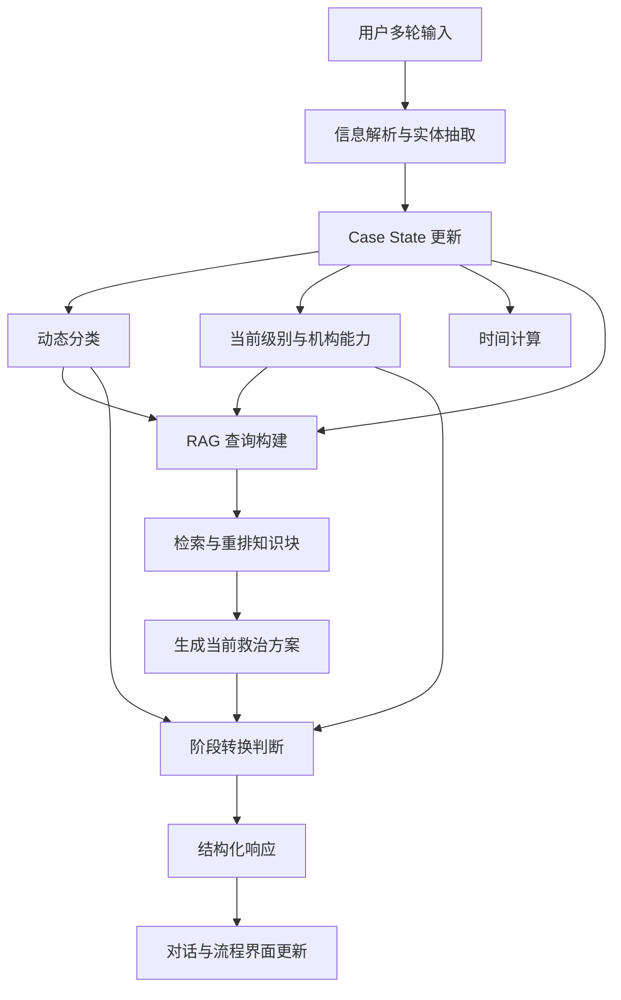

# 战伤分级救治智能推演系统 V1 项目实施说明书

> 文档用途：作为 Cursor、Codex、Claude Code 等编程 AI 的项目实施依据，用于从零搭建或改造“战伤分级救治智能推演系统”。
>
> 文档版本：V1.0  
> 编制日期：2026-09-02  
> 业务依据：《战伤救治规则（2024年版）》  
> 产品性质：流程推演与辅助决策演示系统，不代替专业人员的现场诊断和医疗决策。

---

## 0. 给编程 AI 的执行说明

开始开发前，请先完整阅读本文档，不要只实现页面外观。

实现时必须同时满足以下四类要求：

1. **业务流程正确**：分级救治是主流程；分类救治动态运行；时效救治是软提示；救送结合是阶段转换 Gate；具体伤情规则决定当前处置方案。
2. **交互逻辑正确**：对话推动 Case State 更新，Case State 推动流程节点变化；不能靠用户手动点击“下一救治阶段”改变业务状态。
3. **页面行为正确**：左侧对话区始终是主要内容区；页面整体固定；对话、流程图和详情各自在内部滚动；未开始节点不能点击。
4. **输出可追溯**：Agent 回答必须基于 RAG Chunk；用户能够展开查看具体知识文本、条款和检索相关度。

推荐按本文档第 15 章的开发顺序逐项实现。每完成一个阶段，运行对应验收项后再进入下一阶段。

---

## 1. 项目背景

系统面向战伤案例的连续研判与分级救治流程展示。用户通过多轮对话持续提供伤员状态、生命体征、当前地点、已实施处置和转运情况；系统每轮更新统一的 Case State，并完成：

- 当前救治级别识别；
- 动态分类与优先级判断；
- 当前阶段允许实施的救治方案生成；
- 相关规则知识检索与引用；
- 是否需要更高救治能力的判断；
- 是否满足后送条件的判断；
- 救治流程节点和详情面板更新。

系统核心不是一次性生成一份完整救治报告，而是随着伤情变化，逐轮展示：

```text
用户补充信息
→ Case State 更新
→ 重新分类
→ 检索当前阶段和伤情规则
→ 生成当前阶段方案
→ 判断是否需要阶段转换
→ 更新流程图
→ 等待下一轮信息
```

---

## 2. V1 建设目标与范围

### 2.1 V1 目标

V1 应实现一个可以演示完整业务逻辑的前端系统，并预留真实 Agent、RAG 和后端接口。

必须具备：

- 多轮对话展示；
- Case State 持续更新；
- 四级救治主流程与子节点；
- 节点状态动态变化；
- 当前节点详情展开与收起；
- RAG 知识块折叠展示；
- 时效软提示；
- 阶段转换 Gate；
- 预设案例回放；
- 模拟数据与真实接口可切换的代码结构。

### 2.2 V1 暂不实现

- 不真正调用医疗 Agent 或大模型；
- 不真正连接向量数据库；
- 不根据地图自动选择具体后送机构；
- 不提供真实医疗设备控制；
- 不允许普通用户绕过规则直接切换救治级别；
- 不将演示输出视为临床处方或现场操作授权。

### 2.3 后续可扩展能力

- 接入真实大模型和工具调用；
- 接入《战伤救治规则》RAG 知识库；
- 接入伤票、野战病历和生命体征设备；
- 接入战创伤图片、DR、CT、ECG 等多模态输入；
- 接入真实卫勤机构、距离、床位、能力和运输资源数据；
- 支持多人协作、案例存档和复盘；
- 增加模型评测、规则一致性检查和人工审核。

---

## 3. 已定版的业务概念

### 3.1 分级救治：主流程地图

回答：**伤员现在处于哪一级救治，下一步可能进入哪一级。**

主流程固定为：

```text
Ⅰ级 战现场急救
├─ 初级急救
└─ 高级急救

Ⅱ级 早期救治
├─ 紧急处置
└─ 外科复苏

Ⅲ级 专科治疗
├─ 野战专科救治
└─ 确定性专科治疗

Ⅳ级 康复治疗
├─ 功能恢复
└─ 身心康复
```

主级节点和子级节点必须是不同的可视化节点，不能把子级名称放在主级节点内部作为普通标签。

### 3.2 分类救治：动态优先级判断

回答：**伤员现在有多急，什么问题应该先处理。**

分类不是 Case 的永久属性。每次出现以下情况时应重新分类：

- 用户补充新的生命体征；
- 伤情改善或恶化；
- 完成一项重要处置；
- 到达新的救治机构；
- 准备后送；
- 新发现其他部位损伤。

分类历史必须保留版本，例如：

```text
急救分类 v1
→ 急救分类 v2
→ 急救分类 v3
→ 收容分类 v4
```

《战伤救治规则》包括四种分类：

| 分类类型 | 典型触发位置 | 作用 |
| --- | --- | --- |
| 急救分类 | 现场、营连救治机构 | 初步判断伤势，确定救治和后送优先顺序 |
| 收容分类 | 旅（团）救护所及以上机构 | 复查伤情，区分紧急手术、重症、洗消、后送等方向 |
| 救治分类 | 各医疗组（室） | 明确诊断、救治措施和执行优先顺序 |
| 后送分类 | 准备后送时 | 判断紧急、优先或常规后送，并明确工具、地点和体位 |

V1 案例至少演示“急救分类”和“收容分类”。

### 3.3 伤情专项规则：决定当前方案

回答：**在当前伤情、当前级别和当前能力条件下，现在具体做什么。**

专项规则不能脱离当前救治级别直接输出。Agent 必须同时获得：

- 当前救治阶段；
- 当前机构能力；
- 伤情与生命体征；
- 已完成处置；
- 当前检索到的通用规则；
- 当前检索到的部位伤或伤类专项规则。

如果某操作属于更高一级能力，应显示为“下一阶段所需能力”，而不是当前可直接执行的 Action。

### 3.4 时效救治：软约束

时效由程序计算，不需要单独调用 Agent 判断。

| 救治范围 | 建议时限 |
| --- | --- |
| 初级急救 | 宜在伤后 10 分钟内实施 |
| 高级急救 | 宜在伤后 1 小时内实施 |
| 早期救治 | 宜在伤后 3 小时内实施 |
| 专科治疗 | 宜在伤后 6 小时内实施 |

时间只用于：

- 页面提示；
- 方案紧迫性说明；
- 规划参考；
- 评测是否及时。

禁止实现：

```text
超过 1 小时
→ 强制从高级急救跳到早期救治
```

阶段转换只能由伤情需求、能力差距和后送条件共同决定。

### 3.5 救送结合：阶段转换 Gate

救送结合不单独设计成一个 Agent，而是阶段转换逻辑中的固定 Gate。

核心原则：

```text
需要更高一级救治能力？
        │
        ├─ 否 → 继续当前阶段并复评
        │
        └─ 是 → 检查后送条件
                    │
                    ├─ 伤情稳定/达到转运条件
                    │      → 允许后送
                    │      → 进入下一阶段
                    │
                    └─ 伤情恶化并危及生命
                           → Gate = BLOCKED
                           → 先完成必要稳定处置
                           → 再次评估
```

需要区分两个字段：

```json
{
  "transport_priority": "urgent",
  "transport_readiness": false
}
```

两者同时出现不矛盾，含义是：**非常需要后送，但暂时还不适合转运。**

---

## 4. 整体系统架构



### 4.1 建议模块

| 模块 | 职责 |
| --- | --- |
| Conversation Controller | 管理用户消息、Agent 消息和轮次 |
| Case State Store | 保存当前案例的统一状态 |
| Information Extractor | 从自然语言中抽取生命体征、伤情、位置和已处置事项 |
| Classification Service | 生成动态分类和优先级版本 |
| Stage Resolver | 判断当前救治主级和子级 |
| Timeline Service | 计算伤后时间和建议时限状态 |
| RAG Service | 构造查询、检索、重排并返回知识块 |
| Treatment Planner | 基于当前能力和知识块生成当前方案 |
| Transition Evaluator | 判断是否需要升级、是否满足后送 Gate |
| Response Composer | 生成自然语言回答和结构化 UI 数据 |
| Frontend Workflow | 展示对话、节点、详情、知识依据和历史变化 |

### 4.2 不建议拆成独立 Agent 的模块

- Timeline Service：确定性计算即可；
- Transport Gate：程序规则优先，Agent 只提供结构化伤情判断；
- 页面流程状态：应由结构化字段驱动，不能解析自然语言答案猜测状态。

---

## 5. 核心运行流程

每收到一条新消息，按照以下顺序运行：

```text
1. 接收用户输入
2. 抽取本轮新增事实
3. 与旧状态合并，生成新的 Case State
4. 判断当前机构和救治级别
5. 触发一次新的分类
6. 程序计算伤后时间与建议时限
7. 构建 RAG Query
8. 检索通用规则、当前级别规则和专项伤情规则
9. 对知识块重排与去重
10. 生成限定于当前能力的救治方案
11. 判断是否需要更高一级能力
12. 如果需要，执行 Transport Gate
13. 生成自然语言回答和结构化 JSON
14. 保存本轮快照、分类版本和引用证据
15. 前端更新对话与流程图
```

### 5.1 阶段转换伪代码

```ts
function evaluateStageTransition(state: CaseState): TransitionDecision {
  const needUpgrade =
    state.requiredCapabilities.some(
      capability => !state.currentCapabilities.includes(capability)
    ) || state.injurySpecificRule.requiresHigherLevel;

  if (!needUpgrade) {
    return {
      status: "STAY",
      transitionRequired: false,
      reason: "当前级别仍能继续完成所需救治"
    };
  }

  if (!state.transport.readiness) {
    return {
      status: "BLOCKED",
      transitionRequired: true,
      reason: state.transport.blockingReason,
      currentAction: "先完成必要稳定处置并再次评估"
    };
  }

  return {
    status: "READY",
    transitionRequired: true,
    targetStage: resolveNextStage(state),
    reason: "需要更高一级能力且已满足后送条件"
  };
}
```

注意：`elapsedTime` 不参与硬性 Gate，只作为说明字段。

---

## 6. Case State 数据结构

推荐使用 TypeScript 类型统一前后端契约。

```ts
type MainStage =
  | "battlefield_first_aid"
  | "early_treatment"
  | "specialist_treatment"
  | "rehabilitation";

type SubStage =
  | "primary_first_aid"
  | "advanced_first_aid"
  | "emergency_treatment"
  | "surgical_resuscitation"
  | "field_specialist_treatment"
  | "definitive_specialist_treatment"
  | "functional_recovery"
  | "psychophysical_rehabilitation";

type NodeStatus =
  | "not_started"
  | "current"
  | "transfer_preparing"
  | "blocked"
  | "completed";

type ClassificationType =
  | "emergency_triage"
  | "reception_triage"
  | "treatment_triage"
  | "evacuation_triage";

interface VitalSigns {
  measuredAt: string;
  respiratoryRate?: number;
  systolicBloodPressure?: number;
  diastolicBloodPressure?: number;
  heartRate?: number;
  spo2?: number;
  gcs?: number;
  temperature?: number;
}

interface InjuryFinding {
  id: string;
  category: string;
  bodyPart: string;
  finding: string;
  certainty: "suspected" | "confirmed" | "excluded";
  status: "active" | "controlled" | "worsening" | "improving";
  sourceMessageId: string;
}

interface ClassificationRecord {
  version: number;
  type: ClassificationType;
  createdAt: string;
  severity: "unknown" | "mild" | "moderate" | "severe" | "critical";
  treatmentPriority: "pending" | "routine" | "priority" | "urgent";
  transportPriority: "pending" | "routine" | "priority" | "urgent";
  rationale: string[];
}

interface TransportState {
  needed: boolean;
  priority: "pending" | "routine" | "priority" | "urgent";
  readiness: boolean;
  gateStatus: "ASSESSING" | "BLOCKED" | "READY" | "COMPLETED";
  blockingReason?: string;
  medicalTargetLevel?: MainStage | SubStage;
  targetFacilityType?: string;
  actualFacilityId?: string;
}

interface EvidenceChunk {
  id: string;
  knowledgeBase: string;
  documentTitle: string;
  section: string;
  article?: string;
  text: string;
  retrievalScore: number;
  rerankScore?: number;
  usedInAnswer: boolean;
}

interface TimelineState {
  injuryTime: string;
  currentTime: string;
  elapsedMinutes: number;
  recommendedWindowMinutes?: number;
  timingStatus: "within_window" | "approaching" | "exceeded";
  isHardGate: false;
}

interface TreatmentAction {
  id: string;
  title: string;
  description: string;
  scope: "current_stage" | "next_stage";
  priority: number;
  evidenceChunkIds: string[];
  professionalConfirmationRequired: boolean;
}

interface CaseState {
  caseId: string;
  version: number;
  updatedAt: string;
  currentFacility: {
    id?: string;
    name: string;
    type: string;
    capabilities: string[];
  };
  currentStage: MainStage;
  currentSubStage: SubStage;
  injuries: InjuryFinding[];
  vitalSignsHistory: VitalSigns[];
  completedActions: TreatmentAction[];
  currentActions: TreatmentAction[];
  requiredCapabilities: string[];
  currentCapabilities: string[];
  classificationHistory: ClassificationRecord[];
  transport: TransportState;
  timeline: TimelineState;
  evidence: EvidenceChunk[];
  missingInformation: string[];
}
```

### 6.1 必须保留历史，而不是覆盖

以下字段必须保存历史版本：

- 用户消息；
- Agent 回答；
- 生命体征；
- 分类结果；
- 救治阶段；
- 阶段转换判断；
- RAG 知识块；
- 已完成处置。

建议每轮保存 `CaseSnapshot`：

```ts
interface CaseSnapshot {
  round: number;
  createdAt: string;
  triggerMessageId: string;
  state: CaseState;
  response: AgentTurnResponse;
}
```

---

## 7. Agent 与 RAG 设计

### 7.1 RAG 查询构建

每轮查询不能只使用用户最后一句话。建议组合：

```text
当前救治级别
+ 当前机构能力
+ 已确认伤情
+ 疑似伤情
+ 最新生命体征
+ 生命体征变化趋势
+ 当前需要解决的问题
+ 当前是否准备后送
```

示例：

```text
救治级别：Ⅰ级高级急救
机构：营救护站
伤情：爆炸冲击后胸痛、呼吸困难；右小腿开放伤，出血已控制
生命体征：RR 32/min，SBP 95mmHg，HR 120/min
趋势：高级急救后无明显改善
问题：当前救治方案；是否需要进入早期救治；后送前提
```

### 7.2 检索知识类型

每轮至少覆盖三类知识：

1. **当前救治级别规则**：如初级急救或高级急救技术范围；
2. **分类、时效或救送通用规则**：根据当前任务选择；
3. **伤情专项规则**：如胸部伤、四肢伤、休克等。

### 7.3 建议检索流程

```text
Query Rewrite
→ Metadata Filter
→ 向量/BM25 混合检索
→ Top 20
→ Reranker
→ 去重与规则优先级处理
→ Top 3~6 注入 Prompt
```

建议元数据：

```json
{
  "document": "战伤救治规则（2024年版）",
  "chapter": "第六章",
  "section": "第三节 胸部伤救治",
  "article": "第一〇五条",
  "stage": "battlefield_first_aid",
  "injury_type": "chest_injury",
  "rule_type": "treatment"
}
```

### 7.4 Agent 回答结构

Agent 回答不能只有一句结论，必须至少包含：

```text
已结合哪些知识块进行研判

【阶段确认/初步研判】
当前在哪里、已知问题、不能确认的问题

【当前救治方案】
仅输出当前级别允许的行动

【阶段建议】
是否需要更高级能力、后送优先级、Gate 状态

【需要补充】
只有缺失信息会影响下一步判断时才提出
```

回答生成规则：

- 明确区分“已确认”“疑似”“需排除”；
- 每项关键方案关联至少一个 `evidenceChunkId`；
- 不把未来级别的能力伪装成当前可执行措施；
- 不因时间超限自动跳级；
- 不凭单个分类结果直接决定后送；
- 如果信息不足，先给出当前可执行方案，再要求补充；
- 侵入性操作必须注明“需明确指征并由具备资质的专业人员实施”；
- 回答中可以简要说明知识来源，完整原文由前端折叠菜单展示。

### 7.5 推荐结构化输出

```ts
interface AgentTurnResponse {
  messageId: string;
  round: number;
  naturalLanguageAnswer: string;
  stage: {
    main: MainStage;
    sub: SubStage;
    changed: boolean;
  };
  classification: ClassificationRecord;
  treatmentPlan: TreatmentAction[];
  missingInformation: string[];
  timeline: TimelineState;
  transition: {
    status: "STAY" | "BLOCKED" | "READY" | "COMPLETED";
    targetStage?: MainStage;
    targetSubStage?: SubStage;
    reason: string;
  };
  evidence: EvidenceChunk[];
}
```

### 7.6 Prompt 核心约束模板

```text
你是战伤分级救治流程研判 Agent。你的任务是基于当前 Case State、当前机构能力和提供的知识块，生成当前阶段的辅助救治方案，并判断是否需要阶段转换。

必须遵守：
1. 只把当前救治级别允许的措施列为“当前行动”；更高级别措施只能列为“下一阶段所需能力”。
2. 分类结果是动态判断，每轮重新评估，不可直接沿用上一轮。
3. 时效要求是软提示，不得仅因超过建议时间自动切换阶段。
4. 如果需要更高级救治，必须检查后送 Gate：伤情稳定则尽快后送；伤情恶化危及生命则先完成必要稳定处置，再次评估后送。
5. 同时考虑通用救送原则和伤情专项后送规则。
6. 不得编造知识块中不存在的条款、机构或治疗依据。
7. 信息不足时，先给出当前阶段能够确定的方案，再列出会影响下一步判断的缺失信息。
8. 对侵入性或高风险操作注明需要明确指征和专业人员确认。
9. 输出必须符合指定 JSON Schema。
```

---

## 8. 前端信息架构

### 8.1 页面整体布局

桌面端采用固定视口工作台，不使用整个网页的纵向滚动条。

```text
┌──────────────────────────────────────────────────────────────┐
│ 固定标题栏                                                     │
├──────────────────────────────────────────────────────────────┤
│ 固定案例状态栏：地点 / 阶段 / 伤后时间 / 阶段转换              │
├──────────────────────────────────────────────────────────────┤
│                                                              │
│  左侧对话区（主要内容）        右侧流程区                       │
│  默认约 60%                   默认约 40%                       │
│                                                              │
│  对话在内部滚动              流程图在内部滚动                  │
│                                                              │
├──────────────────────────────────────────────────────────────┤
│ 固定演示免责声明                                               │
└──────────────────────────────────────────────────────────────┘
```

当节点详情展开时：

```text
左侧对话约 54%
右侧整体约 46%
  ├─ 流程树约占右侧 38%
  └─ 节点详情约占右侧 62%
```

无论详情是否展开，左侧对话区必须始终是页面最大单一区域。

### 8.2 滚动规则

桌面端：

- `html`、`body`、根布局固定为 `100vh`；
- 禁止页面整体纵向滚动；
- 对话消息区使用独立纵向滚动条；
- 流程树内容超长时，在流程区域内部滚动；
- 节点详情超长时，在详情区域内部滚动；
- 标题栏、案例状态栏、对话标题、流程标题、对话输入栏始终可见。

建议 CSS：

```css
html,
body {
  height: 100%;
  overflow: hidden;
}

.app-shell {
  height: 100vh;
  display: grid;
  grid-template-rows: 66px auto minmax(0, 1fr);
  overflow: hidden;
}

.workspace {
  min-height: 0;
  overflow: hidden;
}

.conversation-panel {
  display: grid;
  grid-template-rows: auto auto minmax(0, 1fr) auto;
}

.messages {
  min-height: 0;
  overflow-y: scroll;
}
```

小屏设备可以退化为纵向页面滚动，但桌面端必须满足固定工作台要求。

### 8.3 对话区

包含：

- 面板标题；
- 重新演示按钮；
- Round 轮次导航；
- 用户与 Agent 消息；
- RAG 已检索知识块数量标签；
- 固定输入区或“下一轮”演示按钮。

对话行为：

- 切换 Round 时显示该轮及之前的全部消息；
- 新消息出现后，对话区域滚动到最新消息；
- 不能推动整个浏览器页面滚动；
- 切换 Round 时收起已打开的节点详情，避免显示上一轮旧状态。

### 8.4 流程树

主节点与分支节点分别渲染：

```text
Ⅰ级 战现场急救
    ├── 初级急救
    └── 高级急救
```

每个节点必须有：

- 独立边框；
- 节点名称；
- 对应机构或作用说明；
- 状态标记；
- 可点击或禁用状态；
- `aria-expanded` 或 `aria-disabled` 等可访问性属性。

节点状态与交互：

| 状态 | 显示 | 是否可点击 | 点击行为 |
| --- | --- | --- | --- |
| `not_started` | 灰色、弱化 | 否 | 不打开详情 |
| `current` | 青绿色高亮 | 是 | 展开当前节点详情 |
| `transfer_preparing` | 琥珀色 | 是 | 展开转运准备详情 |
| `blocked` | 红色或警示色 | 是 | 展开 Gate 阻塞原因 |
| `completed` | 绿色与勾选 | 是 | 展开历史节点详情 |

点击规则：

```text
第一次点击可交互节点 → 展开详情
再次点击同一节点 → 收起详情
点击另一个可交互节点 → 切换详情
点击未开始节点 → 无动作
切换 Round → 自动收起详情
```

### 8.5 节点详情

详情默认隐藏。展开后位于流程树右侧，内容包括：

- 当前节点；
- 当前机构与机构能力；
- 当前分类及版本；
- 伤势状态；
- 救治优先级；
- 后送优先级；
- 伤后时间和建议时限；
- 当前行动计划；
- 阶段转换 Gate；
- 下一医学目标；
- 知识库依据折叠菜单；
- 收起按钮。

历史节点只展示当时快照，不应使用当前轮状态覆盖历史。

### 8.6 知识库折叠菜单

默认收起，摘要显示：

```text
知识库依据 · 3 个 RAG Chunk    ＋
```

展开后每个 Chunk 显示：

- Chunk 编号；
- 条款名称；
- 文档名称；
- 具体原文；
- 检索相关度；
- Reranker 分数（真实接入后）；
- 是否被本轮答案实际使用。

示例：

```text
Chunk 01 · 第二十一条【救送结合原则】
相关度 0.98

伤情稳定时应当尽快组织后送；伤情恶化危及生命时
应当优先稳定伤情，保证在生命体征稳定状态下实施后送。
```

---

## 9. 推荐前端组件结构

```text
src/
├─ app/
│  ├─ App.tsx
│  └─ routes.tsx
├─ components/
│  ├─ layout/
│  │  ├─ AppHeader.tsx
│  │  ├─ CaseStatusBar.tsx
│  │  └─ WorkspaceLayout.tsx
│  ├─ conversation/
│  │  ├─ ConversationPanel.tsx
│  │  ├─ RoundNavigation.tsx
│  │  ├─ MessageList.tsx
│  │  ├─ UserMessage.tsx
│  │  ├─ AgentMessage.tsx
│  │  └─ DemoComposer.tsx
│  ├─ workflow/
│  │  ├─ TreatmentWorkflow.tsx
│  │  ├─ MainStageNode.tsx
│  │  ├─ SubStageNode.tsx
│  │  ├─ TransitionIndicator.tsx
│  │  └─ NodeStatusBadge.tsx
│  ├─ detail/
│  │  ├─ NodeDetailPanel.tsx
│  │  ├─ ClassificationCard.tsx
│  │  ├─ TimelineCard.tsx
│  │  ├─ TransportGateCard.tsx
│  │  ├─ ActionPlanCard.tsx
│  │  └─ KnowledgeAccordion.tsx
│  └─ common/
│     ├─ Badge.tsx
│     ├─ ScrollArea.tsx
│     └─ EmptyState.tsx
├─ domain/
│  ├─ types.ts
│  ├─ stage-config.ts
│  ├─ transition-rules.ts
│  └─ timeline-rules.ts
├─ store/
│  └─ case-store.ts
├─ services/
│  ├─ api.ts
│  ├─ mock-agent.ts
│  └─ mock-case.ts
├─ hooks/
│  ├─ useCaseReplay.ts
│  └─ useSelectedNode.ts
└─ styles/
   └─ tokens.css
```

如果现有项目已有组件体系，应复用现有结构，不必强行照搬目录名，但领域逻辑和展示组件应分离。

### 9.1 状态管理建议

V1 状态至少包括：

```ts
interface DemoStore {
  currentRound: number;
  snapshots: CaseSnapshot[];
  selectedNodeId: string | null;
  isDetailOpen: boolean;
  goToRound(round: number): void;
  nextRound(): void;
  restart(): void;
  toggleNode(nodeId: string): void;
}
```

`toggleNode` 必须先检查节点状态：

```ts
function toggleNode(node: WorkflowNode) {
  if (node.status === "not_started") return;
  selectedNodeId = selectedNodeId === node.id ? null : node.id;
}
```

---

## 10. 后端接口建议

### 10.1 创建案例

```http
POST /api/cases
```

请求：

```json
{
  "injuryTime": "2026-09-02T15:00:00+08:00",
  "initialFacility": "连抢救组",
  "mode": "demo"
}
```

### 10.2 发送新一轮消息

```http
POST /api/cases/{caseId}/turns
```

请求：

```json
{
  "message": "呼吸每分钟32次，收缩压95，心率120……",
  "attachments": []
}
```

响应：

```json
{
  "snapshot": {},
  "answer": {},
  "workflow": [],
  "selectedNodeId": null
}
```

### 10.3 获取案例历史

```http
GET /api/cases/{caseId}/snapshots
```

### 10.4 获取节点详情

可以由前端直接从 Snapshot 读取。若数据较大，可单独提供：

```http
GET /api/cases/{caseId}/snapshots/{version}/nodes/{nodeId}
```

### 10.5 Demo 与真实 Agent 切换

建议统一接口：

```ts
interface AgentService {
  runTurn(input: AgentTurnInput): Promise<AgentTurnResponse>;
}

class MockAgentService implements AgentService {}
class RemoteAgentService implements AgentService {}
```

前端不应知道当前响应来自预设 Mock 还是真实 Agent。

---

## 11. 五轮演示案例

### 11.1 Round 1：首次报告

用户输入：

> 爆炸后有一名伤员，胸口受伤，现在呼吸很急、胸部疼痛，右小腿还有伤口在流血，人目前能正常回答问题。

状态：

- 当前机构：连抢救组；
- 当前节点：Ⅰ级 → 初级急救；
- 分类：急救分类 v1，信息不足；
- 当前方案：检伤评估、气道与呼吸观察、小腿止血、包扎固定；
- 缺失信息：RR、SBP、HR、SpO₂、胸部是否开放伤、止血效果；
- 阶段转换：暂不触发；
- 知识：初级急救、胸部伤现场救治、急救分类。

### 11.2 Round 2：补充生命体征

用户输入：

> 呼吸大约每分钟32次，胸口没有明显开放伤，但右侧胸部呼吸时疼得厉害。收缩压95，心率120。小腿压迫后基本止住血了。

状态：

- 右小腿出血已基本控制；
- 呼吸与循环异常成为主要风险；
- 分类：急救分类 v2，高优先级；
- 当前节点仍为初级急救；
- 节点状态：转运准备；
- 医学目标：具备高级急救能力的营救护站；
- Gate：可以准备后送；
- 未开始的“高级急救”节点仍不可点击，直到实际进入。

### 11.3 Round 3：到达营救护站

用户输入：

> 现在已经送到营救护站了，血压还是95左右，呼吸仍然很快。

状态：

- 当前节点：Ⅰ级 → 高级急救；
- 初级急救：已完成，可点击查看历史；
- 高级急救：进行中，可点击；
- 分类：急救分类 v3；
- 当前方案：重新检伤分类、生命支持与监护、排查胸部急症；
- 阶段转换：暂不触发，继续评估当前能力是否足够。

### 11.4 Round 4：高级急救后仍未改善

用户输入：

> 经过当前处置后，伤员仍然呼吸困难，血压也没有明显改善。

状态：

- 当前节点：高级急救；
- 需要能力：早期救治；
- 后送优先级：紧急；
- 后送准备状态：暂不满足；
- Gate：`BLOCKED`；
- 原因：伤情尚未稳定；
- 当前动作：必要稳定处置、连续监护、准备接收机构和后送资料；
- 时间接近 1 小时只做提示，不能自动进入Ⅱ级。

### 11.5 Round 5：满足后送条件并进入Ⅱ级

用户输入：

> 经过处理后，血压和呼吸状态有所稳定，可以转运。现在已经到达旅救护所。

状态：

- Gate：`READY → COMPLETED`；
- 当前节点：Ⅱ级 → 紧急处置；
- Ⅰ级节点：已完成，可回看；
- 分类：收容分类 v5；
- 当前方案：复查伤情、收容分类、辅助检查、抗休克与按指征处置；
- 外科复苏、专科治疗和康复治疗：未开始，不可点击。

---

## 12. 视觉规范建议

整体方向：专业、官方、克制，避免消费型医疗 App 风格。

建议颜色：

```css
--navy-950: #081523;
--navy-900: #0c2033;
--navy-800: #17344d;
--teal-600: #087f83;
--teal-500: #0f9fa2;
--amber-600: #b66b0f;
--red-600: #bd3d3a;
--green-600: #397c5c;
--canvas: #eef2f5;
--surface: #ffffff;
```

状态颜色：

| 状态 | 颜色 |
| --- | --- |
| 当前 | 青绿色 |
| 已完成 | 绿色 |
| 转运准备 | 琥珀色 |
| Gate 阻塞 | 红色 |
| 未开始 | 灰蓝色、低透明度 |

设计要求：

- 正文不小于 14px；
- 对话正文建议 15–16px；
- 标签可以使用 11–12px；
- 节点边框和连接线清晰；
- 不依靠颜色作为唯一状态表达，必须同时显示文字；
- 支持 200% 浏览器缩放；
- 尊重 `prefers-reduced-motion`；
- 禁用节点使用 `disabled`，而不只是视觉变灰。

---

## 13. 安全、规则与可追溯要求

### 13.1 医疗安全

- 系统输出定位为辅助研判；
- 页面固定展示免责声明；
- 高风险和侵入性操作需要专业人员确认；
- 不基于缺失信息输出确定性诊断；
- 不允许模型编造生命体征；
- 不允许以模型结论替代后送前医学评估；
- 不允许绕过当前机构能力限制。

### 13.2 知识安全

- 每条关键 Action 必须关联证据；
- 保存检索到但未使用的 Chunk，便于调试；
- 记录知识库版本和文档版本；
- 文档更新后能够追踪旧案例使用的历史版本；
- 如果专项规则与通用规则存在差异，以更具体且当前适用的规则优先，同时记录冲突。

### 13.3 状态安全

- 后端是 Case State 的唯一权威来源；
- 前端不能自行修改 `currentStage`；
- 用户点击流程节点只改变“查看哪个详情”，不能改变业务阶段；
- 每次阶段转换记录触发条件、阻塞原因和证据；
- 不可删除历史分类，只能生成新版本。

---

## 14. 测试与验收标准

### 14.1 业务验收

- [ ] 初始输入后定位为Ⅰ级初级急救；
- [ ] 信息不足时仍先给出当前方案，再要求补充；
- [ ] 每次生命体征变化都会生成新的分类版本；
- [ ] 到达新机构后自动重新分类；
- [ ] 当前能力不足时只提出升级建议，不把高阶措施列为当前操作；
- [ ] `transport_priority = urgent` 与 `readiness = false` 可以同时显示；
- [ ] Gate 为 `BLOCKED` 时不切换救治阶段；
- [ ] Gate 为 `READY` 且已到达目标机构后完成阶段转换；
- [ ] 超过建议时限不会自动切换阶段；
- [ ] RAG Chunk 与回答中的主要措施能够对应。

### 14.2 前端验收

- [ ] 桌面端左侧对话区默认约占 60%；
- [ ] 节点详情展开后左侧仍大于 50%；
- [ ] 页面整体没有纵向滚动条；
- [ ] 对话超长后只在消息区内部滚动；
- [ ] 标题栏、状态栏、流程标题和输入区始终可见；
- [ ] 流程树与详情超长时各自内部滚动；
- [ ] 主级节点和子级节点均有独立边框；
- [ ] 当前、转运准备和已完成节点可以点击；
- [ ] 未开始节点不可点击且不可获得交互焦点；
- [ ] 再次点击同一节点会收起详情；
- [ ] 切换另一个可用节点会切换详情；
- [ ] 切换 Round 会自动收起旧详情；
- [ ] 知识库依据默认收起；
- [ ] 展开后显示完整 Chunk 文本和分数；
- [ ] 键盘和屏幕阅读器能够识别节点状态。

### 14.3 数据验收

- [ ] Case State 有明确版本号；
- [ ] 历史生命体征不被覆盖；
- [ ] 历史分类不被覆盖；
- [ ] 每轮保存 Snapshot；
- [ ] 每项行动带证据 ID；
- [ ] UI 节点状态由结构化字段驱动；
- [ ] Mock Agent 与真实 Agent 使用同一个响应接口。

---

## 15. 推荐开发顺序

### 阶段一：搭建静态工作台

1. 创建固定标题栏和案例状态栏；
2. 创建 60%/40% 的左右工作区；
3. 实现页面固定和内部滚动；
4. 完成对话面板与流程面板基本样式；
5. 用静态数据渲染四级流程树。

验收：页面比例和滚动行为符合第 8 章。

### 阶段二：建立领域模型和 Mock 数据

1. 建立第 6 章类型；
2. 把五轮案例做成 `CaseSnapshot[]`；
3. 统一生成每轮节点状态；
4. 不允许组件内部硬编码当前阶段。

验收：切换 Round 可以还原每一轮完整状态。

### 阶段三：实现流程节点交互

1. 拆分主级与子级节点组件；
2. 实现可点击状态判断；
3. 实现详情展开、切换和收起；
4. 实现未开始节点禁用；
5. 实现历史节点详情。

验收：通过第 14.2 节全部节点交互项。

### 阶段四：实现完整 Agent 消息展示

1. 按“研判—方案—阶段—补充信息”渲染回答；
2. 显示 RAG Chunk 数量；
3. 对话新增后自动滚动到末尾；
4. 保证长消息不会推动页面整体滚动。

### 阶段五：实现知识折叠区

1. 创建 `KnowledgeAccordion`；
2. 渲染文档、条款、原文和分数；
3. 把 Action 与 Chunk ID 关联；
4. 默认折叠，用户主动展开。

### 阶段六：实现规则服务

1. Timeline Service；
2. Classification Version；
3. Stage Resolver；
4. Transition Evaluator；
5. 单元测试覆盖时效软约束和 Transport Gate。

### 阶段七：预留后端与真实 Agent

1. 抽象 `AgentService`；
2. 保留 `MockAgentService`；
3. 增加 `RemoteAgentService`；
4. 实现 API 错误、加载、超时和重试状态；
5. 确保失败时不会破坏上一轮 Case State。

### 阶段八：最终验收

1. 运行单元测试；
2. 运行组件交互测试；
3. 运行五轮端到端案例；
4. 检查桌面分辨率和小屏退化；
5. 逐项核对第 14 章验收清单。

---

## 16. 建议自动化测试案例

```ts
describe("stage transition", () => {
  it("does not change stage only because timing window is exceeded", () => {});
  it("blocks transport when higher capability is needed but readiness is false", () => {});
  it("moves to early treatment when readiness becomes true and arrival is confirmed", () => {});
});

describe("workflow nodes", () => {
  it("does not open details for not-started nodes", () => {});
  it("opens details for current and completed nodes", () => {});
  it("closes details when the selected node is clicked again", () => {});
  it("closes stale details when round changes", () => {});
});

describe("workspace scrolling", () => {
  it("keeps document body fixed on desktop", () => {});
  it("scrolls long conversation inside message list", () => {});
  it("keeps header, status bar and composer visible", () => {});
});

describe("rag evidence", () => {
  it("renders evidence chunks inside a collapsed accordion", () => {});
  it("links every critical action to at least one chunk", () => {});
  it("shows exact document and article metadata", () => {});
});
```

---

## 17. 可以直接交给 Cursor 的启动指令

将本文档放入项目根目录后，可以对 Cursor 输入：

```text
请完整阅读《战伤分级救治智能推演系统-V1项目实施说明书.md》，然后检查当前项目结构和已有代码。

任务目标：按照说明书实现 V1 系统。不要一次性盲目重写全部代码，也不要只还原视觉效果。先输出：
1. 当前代码与说明书的差距清单；
2. 计划新增或修改的目录与文件；
3. 分阶段实施计划；
4. 需要我确认的关键技术选择。

确认后，从“固定工作台布局 + Case State 类型 + 五轮 Mock Snapshot”开始实现。每完成一个阶段：
- 运行相关测试；
- 汇报修改文件；
- 对照说明书验收项；
- 不得自行修改已经定版的业务规则。

特别注意：
- 左侧对话始终占页面主要区域；
- 桌面端页面整体固定，长内容在区域内部滚动；
- 未开始节点不可点击；
- 点击同一可用节点可以展开和收起详情；
- 时效是软约束；
- 救送结合是 Stage Transition Gate；
- Agent 回答必须包含具体当前方案，并能追溯到 RAG Chunk；
- 前端点击节点只能查看信息，不能直接改变救治阶段。
```

---

## 18. 最终交付物建议

项目至少交付：

```text
1. 前端源代码
2. 后端或 Mock Agent 服务
3. 五轮演示案例数据
4. Case State 和 API 类型定义
5. 阶段转换规则与单元测试
6. RAG Chunk 示例和知识折叠组件
7. README 启动说明
8. 本项目实施说明书
9. 验收测试报告
```

正式接入真实医疗 Agent 前，还应补充：

- 医生审核记录；
- 规则覆盖率报告；
- RAG 检索评测；
- 模型回答忠实度评测；
- 高风险输出拦截策略；
- 真实卫勤资源数据接口说明。

