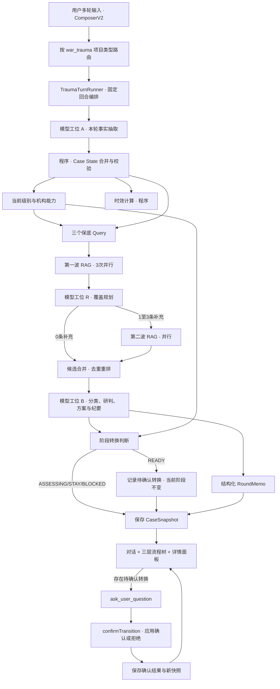

# 战伤分级救治智能推演系统 · 实施说明书

> 文档用途：作为 Cursor、Codex、Claude Code 等编程 AI 改造 **med-pilotdeck 战创伤（`war_trauma`）项目工作台** 的实施依据。
>
> 文档版本：V2.2（2026-09-03 改版，取代 V1.0）
> 业务依据：《战伤救治规则（2024年版）》
> 产品性质：流程推演与辅助决策系统，不代替专业人员的现场诊断和医疗决策。

## V2.2 相对 V1.0 的定版变更

V1.0 描述的是「从零搭一个独立推演站点 + Mock Agent」。V2.2 改为「在已有 med-pilotdeck 上改造战创伤项目的会话工作台」。以下十条为已定版决策，实现时不得偏离：

| # | 决策 |
| --- | --- |
| 1 | 主流程仅使用《战伤救治规则》的**战现场急救（Ⅰ级）与早期救治（Ⅱ级）**；流程图为 **三层阶梯**：主级 → 子级 → 每轮对话生成的「纪要叶子」 |
| 2 | 战创伤工作台**只做伤情推演**；教材知识点问答不是本工作台的默认能力 |
| 3 | 第一期采用**演示对话 + 演示流程**：左侧用 PilotDeck 标准消息行展示预置对话，右侧使用预置案例数据；第二期再接真实 Runner |
| 4 | 模型给出 `ASSESSING` / `STAY` / `READY` / `BLOCKED` 医学建议；正常转换在**真正写入新阶段前必须经 `ask_user_question` 由用户确认** |
| 5 | Case State 跟**单条会话**走，落在 `$PILOT_HOME/memory/trauma_med/<projectId>/cases/<sessionId>/`，与通用医学 `general_med` 分开 |
| 6 | 只允许**新建** `war_trauma` 项目进入新工作台；已迁到通用医学的旧项目不迁回 |
| 7 | 推演主路径由 `war_trauma` 专用的**固定回合编排器**驱动；整体推演不包装成 Skill，模型只承担结构化事实抽取、伤情研判、方案与纪要生成等指定工位 |
| 8 | Gate 使用**模型医学研判 + 程序安全约束**的混合判断；规则冲突无法消解时进入 `ASSESSING`，不得猜测为 `READY` |
| 9 | 用户可通过独立控件强制进入任意后续阶段；必须填写理由、确认风险并完整留痕，`BLOCKED` 时二次确认；转换事件不新增纪要叶子 |
| 10 | RAG 使用有预算的自适应检索：有效病例回合至少 3 次、最多 6 次，所有候选 Chunk 落盘，重排后向模型注入 10–15 条 |

**详情面板的打开对象也随之改变**：不再点击「初级急救」这类子级节点打开详情，只有子级下的**轮次纪要叶子**可点击；详情内必须包含一块面向人读的「当前伤员状态」。

---

## 目录

- [0. 给编程 AI 的执行说明](#0-给编程-ai-的执行说明)
- [1. 改版定位与现有能力底座](#1-改版定位与现有能力底座)
- [2. 分期范围](#2-分期范围)
- [3. 已定版的业务概念](#3-已定版的业务概念)
- [4. 系统架构（复用现有会话与 RAG）](#4-系统架构复用现有会话与-rag)
- [5. 每轮运行流程](#5-每轮运行流程)
- [6. 数据结构](#6-数据结构)
- [7. 固定回合编排、模型工位与 RAG](#7-固定回合编排模型工位与-rag)
- [8. 阶段转换与用户确认](#8-阶段转换与用户确认)
- [9. 前端信息架构（嵌入 ChatV2）](#9-前端信息架构嵌入-chatv2)
- [10. 存储与会话绑定](#10-存储与会话绑定)
- [11. 项目类型与入口改造](#11-项目类型与入口改造)
- [12. 五轮演示案例](#12-五轮演示案例)
- [13. 视觉规范](#13-视觉规范)
- [14. 安全、规则与可追溯](#14-安全规则与可追溯)
- [15. 验收标准](#15-验收标准)
- [16. 分期开发顺序](#16-分期开发顺序)
- [17. 建议自动化测试](#17-建议自动化测试)
- [18. 交付物](#18-交付物)
- [附录 A. V1.0 已删除内容与原因](#附录-a-v10-已删除内容与原因)

---

## 0. 给编程 AI 的执行说明

开发前请完整阅读本文档，并同时阅读仓库中：

- `docs/workspace-project-types-phased.zh.md` — 项目类型、目录布局、`trauma_med` 现状
- `docs/system-prompt-anatomy.zh.md` — 战创伤项目的人设与技能可见性
- `docs/war-injury-treatment-demo.html` — 目标 UI 原型（三层树 + 纪要叶子 + 伤员状态）
- `plugins/med-tools/skills/med-trauma-assist/SKILL.md` — 现有战创伤 RAG 检索能力

实现时必须同时满足五类要求：

1. **复用而非重造**：会话、流式、附件和 RAG 通道复用现有实现；新增 `war_trauma` 专用回合编排器、结构化 Case State 与「战创伤推演工作台」，不新建独立 Agent 进程。
2. **业务流程正确**：分级救治是主流程；分类救治动态运行；时效救治是软提示；救送结合是阶段转换 Gate；伤情专项规则决定当前处置。
3. **交互逻辑正确**：对话推动 Case State，Case State 推动流程节点；点击纪要叶子只切换「看哪份详情」，永不改变业务阶段；正常阶段转换经用户确认，人工覆盖经独立控件、风险确认与审计。
4. **页面行为正确**：左侧对话区始终是最大单一区域；工作台内部各区独立滚动；未开始的节点不可点击；只有纪要叶子可打开详情。
5. **输出可追溯**：关键处置能追到 RAG Chunk；用户可展开查看原文、条款与相关度。

按第 16 章顺序推进，每期跑完对应验收项再进入下一期。

---

## 1. 改版定位与现有能力底座

### 1.1 定位

战创伤工作台是 **med-pilotdeck 内 `war_trauma` 项目的会话页形态**，不是独立网站，不带独立登录、独立顶栏和独立品牌。用户新建战创伤项目并进入会话后，原本的单栏聊天页替换为：

```text
第一期：左侧预置对话（MessageRowV2）  右侧预置流程树与详情
第二期：左侧真实对话（ChatV2）       右侧真实流程树与纪要叶子详情
```

以下逐轮闭环描述第二期目标：

系统面向战伤案例的连续研判：用户多轮提供伤员状态、生命体征、当前地点、已实施处置与转运情况；系统每轮更新统一 Case State，并给出当前级别可执行方案、分类版本、时效提示、后送 Gate 判断与知识依据。

核心不是一次性生成完整救治报告，而是随伤情变化逐轮推进：

```text
用户补充信息
→ Case State 更新
→ 重新分类
→ 检索当前阶段与伤情规则
→ 生成当前级别方案
→ 判断是否需要阶段转换（模型建议 + 用户确认）
→ 更新三层流程图并追加本轮纪要叶子
→ 等待下一轮信息
```

### 1.2 必须复用的现有能力

| 能力 | 现有实现 | 改造要求 |
| --- | --- | --- |
| 会话与流式 | `ui/src/components/chat-v2/ChatInterfaceV2.tsx`、`MessagesPaneV2`、`ComposerV2` | 第二期接真实 Runner 时复用；第一期仅复用 `MessageRowV2` 展示预置对话 |
| 会话存储 | `$PILOT_HOME/projects/trauma_med/<projectId>/chats/<sessionId>.jsonl` | 不重复存聊天正文 |
| 项目类型 | `ui/server/projects.js` 的 `PROJECT_TYPES.WAR_TRAUMA` / `trauma_med` | 重新开放创建 |
| 人设 | `src/context/prompt/systemPromptCopy.ts` 战创伤人设 | 补推演工作台相关约束 |
| RAG | `mcp__med-tools__med_trauma_rag_query`（远程 med-rag，可降级本地语料） | 复用检索通道，仅改 query 构建与结果落位 |
| 提问卡片 | `ask_user_question` | 用于阶段转换确认 |
| 项目记忆 | `$PILOT_HOME/memory/trauma_med/<projectId>/` | 与 Case State 分目录，互不干扰 |

命名约定：逻辑项目类型使用 `general_medicine` / `war_trauma`；磁盘存储分区使用 `general_med` / `trauma_med`，不得混作同一枚举。

### 1.3 与现有六阶段工具的关系

现有 `med-trauma-stage-plan` 使用「伤员发生地 / 野战分类场 / 收容处置组 / 重伤救治组 / 手术组 / 洗消组」六阶段，一次生成一段正式长方案。它与本工作台的 Ⅰ–Ⅳ 级主轴**不是同一张流程地图**，因此：

- 工作台主轴与流程树**只用 Ⅰ–Ⅳ 级**；
- 六阶段可作为「当前机构 / 医疗组」的描述性标签，不作为流程主轴；
- 六阶段正式长方案降级为详情面板中的可选导出动作，不作为主交互；
- 不得在同一界面并列两套流程主轴。

---

## 2. 分期范围

### 2.1 第一期（本次实施目标）：演示对话 + 演示流程

必须具备：

- 新建 `war_trauma` 项目可用，进入会话即为推演工作台；
- 左侧使用 PilotDeck 标准消息行展示 HTML 案例中的预置对话，不挂载真实 `ChatInterfaceV2`；
- 右侧三层流程树：Ⅰ–Ⅳ 主级、子级、每轮纪要叶子；
- 纪要叶子可点击并打开详情；主级与子级不可点击；
- 详情包含：当前伤员状态（可读）、本轮纪要、动态分类、时效提示、阶段转换 Gate、当前行动计划、知识依据折叠区；
- 右侧数据来自预置五轮案例（演示数据），并保证与真实结构同构；
- 视觉与 PilotDeck 一致，支持明暗主题。

第一期**不要求**真实发消息，也不要求右侧流程随真实每轮对话自动生长。

### 2.2 第二期：接真实每轮状态

- 每条用户消息由专用 `TraumaTurnRunner` 按固定步骤处理，返回结构化 `AgentTurnResponse`；
- 纪要叶子由真实轮次追加；
- Case State 按会话落盘并支持刷新回放；
- 阶段转换走 `ask_user_question` 真实确认链路。
- 支持正常确认与受控人工阶段覆盖。

### 2.3 明确不做

- 不再造独立站点、独立顶栏、独立登录；
- 不另起一套 Conversation Controller、消息存储或 RAG 流水线；
- 不把整套推演包装成 Skill，也不让通用 Agent 自主决定是否执行流程步骤；
- 不引入通用工作流引擎；固定编排直接实现为可测试的应用层 Runner；
- 不做 `MockAgentService` / `RemoteAgentService` 双实现抽象（第一期演示数据只喂前端，不伪装成后端）；
- 不根据地图自动选择具体后送机构；
- 不提供真实医疗设备控制；
- 不允许前端静默改级；人工覆盖必须经过后端 Runner 校验、风险确认与审计；
- 不把演示输出当作临床处方或现场操作授权；
- 本工作台不承担教材知识点问答（保留在通用能力/其他会话）。

### 2.4 后续可扩展

- 接入伤票、野战病历与生命体征设备；
- 接入战创伤图片、DR、CT、ECG 等多模态输入；
- 接入真实卫勤机构、距离、床位、能力与运输资源数据；
- 多人协作、案例存档与复盘；
- 模型评测、规则一致性检查与人工审核。

---

## 3. 已定版的业务概念

### 3.1 分级救治：三层流程地图

回答：**伤员现在处于哪一级救治，这一级里发生过什么，下一步可能进入哪一级。**

主级与子级固定为：

```text
Ⅰ级 战现场急救
├─ 初级急救
└─ 高级急救

Ⅱ级 早期救治
├─ 紧急处置
└─ 外科复苏
```

> 产品范围说明：流程树、落位、人工覆盖和具体操作意见只覆盖上述两级四个子级。若Ⅱ级病例需要更高级能力，只提示建议转入“专科治疗（Ⅲ级）”或“康复治疗（Ⅳ级）”，并说明系统仅能提供前两级操作意见；不展示后两级节点，也不输出其子级、机构或具体处置措施。

**第三层是每轮对话生成的纪要叶子**，挂在该轮所属子级下：

```text
Ⅰ级 战现场急救                     ← 第一层：主级，静态节点，不可点击
├─ 初级急救                         ← 第二层：子级，静态节点，不可点击
│   ├─ R1 首次报告                  ← 第三层：纪要叶子，可点击 → 打开详情
│   └─ R2 生命体征补充
└─ 高级急救
    ├─ R3 到达营救护站
    └─ R4 后送受阻
Ⅱ级 早期救治
└─ 紧急处置
    └─ R5 进入Ⅱ级
```

三层节点必须是三种不同的可视化节点，呈阶梯式缩进；不得把子级或纪要塞进上层节点内部当普通文字标签。

纪要叶子的内容形态类似会议纪要，是**本轮输入与输出的要点概括**，不是 Agent 回答全文：

| 字段 | 说明 | 长度建议 |
| --- | --- | --- |
| `title` | 本轮标题，如「生命体征补充」 | ≤ 10 字 |
| `inputPoints` | 用户本轮提供的关键信息要点 | 每条 ≤ 30 字，2–4 条 |
| `actionPoints` | 本轮已实施 / 本级应实施的处置要点 | 每条 ≤ 30 字，2–4 条 |
| `conclusion` | 本轮研判结论一句话 | ≤ 40 字 |

生成规则：

- 未开始的主级 / 子级下**不得出现**纪要叶子；
- 每轮只产生一个叶子，挂在该轮结束时所处的子级下；
- 同一子级下的叶子按轮次正序排列；
- 叶子只增不改；伤情反复时追加新叶子，不覆盖旧叶子。

### 3.2 分类救治：动态优先级判断

回答：**伤员现在有多急，什么问题应该先处理。**

分类不是 Case 的永久属性。出现以下情况应重新分类：

- 用户补充新的生命体征；
- 伤情改善或恶化；
- 完成一项重要处置；
- 到达新的救治机构；
- 准备后送；
- 新发现其他部位损伤。

分类历史必须保留版本：

```text
急救分类 v1 → 急救分类 v2 → 急救分类 v3 → 收容分类 v4
```

《战伤救治规则》包括四种分类：

| 分类类型 | 典型触发位置 | 作用 |
| --- | --- | --- |
| 急救分类 | 现场、营连救治机构 | 初步判断伤势，确定救治和后送优先顺序 |
| 收容分类 | 旅（团）救护所及以上机构 | 复查伤情，区分紧急手术、重症、洗消、后送等方向 |
| 救治分类 | 各医疗组（室） | 明确诊断、救治措施和执行优先顺序 |
| 后送分类 | 准备后送时 | 判断紧急、优先或常规后送，并明确工具、地点和体位 |

演示案例至少覆盖「急救分类」和「收容分类」。

### 3.3 伤情专项规则：决定当前方案

回答：**在当前伤情、当前级别和当前能力条件下，现在具体做什么。**

专项规则不能脱离当前救治级别直接输出。生成方案时必须同时具备：

- 当前救治阶段；
- 当前机构能力；
- 伤情与生命体征；
- 已完成处置；
- 检索到的通用规则；
- 检索到的部位伤或伤类专项规则。

属于更高一级能力的操作，只能显示为「下一阶段所需能力」，不得列为当前可执行 Action。

### 3.4 时效救治：软约束

时效由程序计算，不调用模型判断。

| 救治范围 | 建议时限 |
| --- | --- |
| 初级急救 | 宜在伤后 10 分钟内实施 |
| 高级急救 | 宜在伤后 1 小时内实施 |
| 早期救治 | 宜在伤后 3 小时内实施 |

时间只用于：页面提示、方案紧迫性说明、规划参考、评测是否及时。

禁止实现：

```text
超过 1 小时 → 强制从高级急救跳到早期救治
```

阶段转换只能由伤情需求、能力差距和后送条件共同决定，并经用户确认。

### 3.5 救送结合：阶段转换 Gate

救送结合不是独立 Agent，而是阶段转换逻辑中的固定状态机。医学前提由模型结合 RAG 规则研判，程序负责状态约束、证据校验与用户确认：

```text
需要更高一级救治能力？
        │
        ├─ 否 → 继续当前阶段并复评
        │
        └─ 是 → 检查后送条件
                    │
                    ├─ 伤情稳定 / 达到转运条件
                    │      → Gate = READY
                    │      → 询问用户是否确认转换（见第 8 章）
                    │
                    └─ 伤情恶化并危及生命
                           → Gate = BLOCKED
                           → 先完成必要稳定处置
                           → 再次评估
```

需要区分两个字段：

```json
{
  "transportPriority": "urgent",
  "transportReadiness": "not_ready"
}
```

两者同时出现不矛盾，含义是：**非常需要后送，但暂时还不适合转运**。此时 Gate 必须为 `BLOCKED`，不得弹出阶段转换确认。

---

## 4. 系统架构（复用现有会话与 RAG）

本章至第 8 章描述第二期真实推演契约；第一期只使用同构演示数据，不执行 Runner。



### 4.1 模块职责

| 模块 | 归属 | 职责 |
| --- | --- | --- |
| 会话与消息 | **现有 ChatV2 / 会话引擎** | 用户消息、Agent 消息、流式、附件、轮次 |
| Trauma Turn Router | 现有会话链路中的项目类型分支 | 仅对新建 `war_trauma` 会话调用固定 Runner；其他项目保持原链路 |
| TraumaTurnRunner | 新增应用层模块 | 按第 5 章固定顺序调度状态、RAG、模型工位、Gate、持久化与返回 |
| Case State Store | 新增（前端 store + 会话级落盘） | 保存当前案例统一状态与历史快照 |
| Information Extractor | 模型工位 A + Schema 校验 | 只抽取生命体征、伤情、位置、已处置事项和缺失信息 |
| Classification Service | 模型工位 B + 程序校验 | 生成动态分类与优先级版本 |
| Stage Resolver | 程序 | 由 Case State 推导当前主级与子级 |
| Timeline Service | 程序 | 伤后时间与建议时限状态 |
| RAG Query Builder | Runner 内确定性模块 | 根据 Case State 和待解决问题生成多维检索请求 |
| RAG Service | **现有 med-tools** | 执行检索、重排并返回知识块；不负责决定业务流程 |
| Treatment Planner | 模型工位 B | 基于当前能力与 Runner 提供的知识块生成当前方案 |
| Transition Evaluator | 模型医学研判 + 程序安全约束 + 用户确认 | 是否升级、Gate 状态、冲突处理、确认或人工覆盖落地 |
| Memo Composer | 模型工位 B | 生成本轮纪要叶子要点 |
| Trauma Workspace UI | 新增 | 三层流程树、纪要叶子、详情面板、伤员状态视图 |

### 4.2 不允许拆成独立 Agent 或独立服务

- Timeline：确定性计算即可；
- Transport Gate：模型负责结合通用与专项规则进行医学研判，程序负责安全约束、状态机和用户确认；
- 流程节点状态：必须由结构化字段驱动，禁止解析自然语言答案猜测阶段；
- 会话管理：一律走现有引擎。

### 4.3 Runner 的边界

`TraumaTurnRunner` 是应用层的固定函数/类，不是新的自治 Agent，也不是需要安装的通用工作流引擎。它必须满足：

- 由 `projectType === "war_trauma"` 的会话路由直接触发，不依赖模型识别用户意图；
- 步骤、输入输出与失败策略写在代码中，模型不得跳步、换序或自行选择是否检索；
- 模型工位只接收完成当前任务所需的最小上下文，并按 JSON Schema 返回；
- RAG 查询由 Runner 保证最低覆盖；模型可提出预算内的补充 query，但不能自由循环调用检索工具；
- 任一模型输出先经 Schema 与业务规则校验，再允许合并状态；
- `READY` 仅是建议，Runner 必须暂停阶段写入并发起用户确认；
- 普通聊天 Skills 可以继续存在，但不承担推演主路径，也不能改变 Case State。

---

## 5. 每轮运行流程

每收到一条新消息，由 `TraumaTurnRunner` 按以下顺序运行。以下顺序是程序契约，不是写给模型自行遵循的操作手册：

```text
1.  接收用户输入（ComposerV2，可带附件）
2.  读取当前会话的最新 Case State；不存在则初始化
3.  调用模型工位 A，抽取本轮新增事实（结构化返回）
4.  校验抽取结果并与旧状态合并，生成候选 Case State
5.  程序解析当前机构、救治主级与子级
6.  程序计算伤后时间与建议时限状态
7.  Runner 建立最低三维检索计划，并行执行第一波 3 次 med_trauma_rag_query
8.  调用轻量检索规划工位 R 检查覆盖度，提出 0–3 条补充 query
9.  工位 R 输出 1–3 条有效补充 query 时并行执行第二波；每轮总调用数限制为 3–6 次
10. 对全部知识块去重、重排、记录检索降级状态并完整落盘，选择 10–15 条注入模型
11. 调用模型工位 B，生成动态分类、当前能力内方案、医学 Gate 研判、自然语言回答与纪要
12. 对模型输出执行 Schema、证据引用、能力边界、规则冲突与高风险约束校验
13. 程序根据模型研判执行 Gate 状态机；程序不重新作医学诊断
14. Gate = READY 时写入 pendingTransition，但保持 currentStage 不变
15. 生成 Case State（版本 +1）与本轮 CaseSnapshot
16. 原子保存状态、分类版本、纪要和引用证据
17. 将回答写入现有会话流，在对应子级下追加纪要叶子；READY 时同时发出 ask_user_question
```

“有效病例回合”包括：

- `case_update`：新增伤情、生命体征、地点、处置或能力事实；
- `correction`：更正既往病例事实；
- `question`：要求基于当前 Case State 进行伤情研判或生成处置方案。

`no_case_update`、确认卡片、人工阶段覆盖和纯界面操作不执行 3–6 次 RAG。READY 所在的 `runTurn` 正常生成一枚纪要叶子；随后对确认卡片的操作不再生成第二枚叶子。

工位 A 返回 `no_case_update` 时，Runner 在第 3 步后提前结束：不调用工位 R/B，不更新分类或 Gate，不增加版本、Snapshot、RoundMemo；首次空病例返回固定引导语，已有病例只返回简短提示，要求用户继续提供伤情、处置或研判问题。

`runTurn` 不得阻塞等待用户回答。用户随后操作确认卡片时，由 `confirmTransition` 处理该事件：

```text
1. 校验待确认转换仍属于最新 Case State，拒绝过期确认
2. 用户确认：应用 targetStage / targetSubStage；用户拒绝：保持 currentStage
3. 清除 pendingTransition，记录确认结果并生成新的 CaseSnapshot
4. 原子落盘并刷新流程树；确认事件本身不新增纪要叶子
```

用户也可通过独立的“调整救治阶段”控件强制进入任意后续阶段。人工覆盖不走 `runTurn`，转换后不立即重新检索或生成方案；下一条有效病例消息才按新阶段执行完整回合。

每次成功持久化事件（`agent_turn`、`transition_confirmation`、`manual_stage_override`）都使 `CaseState.version + 1` 并生成一条 Snapshot；只有 `agent_turn` 增加 `round` 并生成纪要。`RoundMemo.snapshotVersion` 必须等于创建该叶子时的 `CaseState.version`。

任一步失败时不得提交半成品 State；允许返回受控错误或基于上一个快照重试。

---

## 6. 数据结构

推荐用 TypeScript 类型统一前后端契约。

### 6.1 基础枚举

```ts
type MainStage =
  | "battlefield_first_aid"
  | "early_treatment"
  | "specialist_treatment"
  | "rehabilitation";

type SubStage =
  | "primary_first_aid"
  | "advanced_first_aid"
  | "emergency_treatment"
  | "surgical_resuscitation"
  | "field_specialist_treatment"
  | "definitive_specialist_treatment"
  | "functional_recovery"
  | "psychophysical_rehabilitation";

type NodeStatus =
  | "not_started"
  | "current"
  | "transfer_preparing"
  | "blocked"
  | "completed";

type ClassificationType =
  | "emergency_triage"
  | "reception_triage"
  | "treatment_triage"
  | "evacuation_triage";
```

### 6.2 伤情与状态

```ts
interface VitalSigns {
  measuredAt: string;
  sourceMessageId: string;
  respiratoryRate?: number;
  systolicBloodPressure?: number;
  diastolicBloodPressure?: number;
  heartRate?: number;
  spo2?: number;
  gcs?: number;
  temperature?: number;
}

interface InjuryFinding {
  id: string;
  category: string;
  bodyPart: string;
  finding: string;
  certainty: "suspected" | "confirmed" | "excluded";
  status: "active" | "controlled" | "worsening" | "improving";
  sourceMessageId: string;
  sourceQuote: string;
  confidence: number;
}

interface ClassificationRecord {
  version: number;
  type: ClassificationType;
  createdAt: string;
  severity: "unknown" | "mild" | "moderate" | "severe" | "critical";
  treatmentPriority: "pending" | "routine" | "priority" | "urgent";
  transportPriority: "pending" | "routine" | "priority" | "urgent";
  rationale: string[];
}

interface TransportState {
  needed: boolean;
  priority: "pending" | "routine" | "priority" | "urgent";
  readiness: "unknown" | "ready" | "not_ready";
  gateStatus: "ASSESSING" | "STAY" | "BLOCKED" | "READY" | "COMPLETED";
  blockingReason?: string;
  medicalTargetLevel?: MainStage | SubStage;
  targetFacilityType?: string;
  actualFacilityId?: string;
  /** 用户对阶段转换的确认结果，见第 8 章。 */
  confirmation?: StageTransitionConfirmation;
}

interface TimelineState {
  injuryTime: string;
  currentTime: string;
  elapsedMinutes: number;
  recommendedWindowMinutes?: number;
  timingStatus: "within_window" | "approaching" | "exceeded";
  isHardGate: false;
}

interface EvidenceChunk {
  id: string;
  knowledgeBase: string;
  documentTitle: string;
  section: string;
  article?: string;
  text: string;
  retrievalScore: number;
  rerankScore?: number;
  coverageTags: Array<"stage" | "classification_transport" | "primary_injury" | "supplemental">;
  /** 候选池中被选入模型上下文。 */
  selectedForPrompt: boolean;
  usedInAnswer: boolean;
  /** 来自现有检索通道：remote 表示远程 med-rag，local 表示插件内置语料。 */
  retrievalBackend: "remote" | "local";
}

interface RetrievalTrace {
  queries: Array<{
    wave: 1 | 2;
    kind: "stage" | "classification_transport" | "primary_injury" | "supplemental";
    query: string;
    reason: string;
    critical: boolean;
    chunkIds: string[];
  }>;
  totalCalls: number;
  allChunkIds: string[];
  promptChunkIds: string[];
  criticalCoverageGaps: string[];
}

interface TreatmentAction {
  id: string;
  title: string;
  description: string;
  scope: "current_stage" | "next_stage";
  priority: number;
  evidenceChunkIds: string[];
  professionalConfirmationRequired: boolean;
}
```

### 6.3 模型工位 A：本轮事实增量

工位 A 只输出本轮明确出现或被更正的事实，不重复生成完整 Case State。核心 Schema 保持六组，低频信息放入 `extensions`，避免顶层字段无限膨胀。

```ts
interface ExtractedFact<T = unknown> {
  value: T;
  sourceMessageId: string;
  sourceQuote: string;
  measuredAt?: string;
  certainty: "confirmed" | "suspected" | "excluded" | "unknown";
  confidence: number;
  supersedesFactId?: string;
}

interface ExtractedTurnFacts {
  turnKind: "case_update" | "correction" | "question" | "no_case_update";
  context: {
    eventTime?: ExtractedFact<string>;
    location?: ExtractedFact<string>;
    facility?: ExtractedFact<string>;
  };
  vitalSigns: Array<ExtractedFact<{
    type: "respiratory_rate" | "blood_pressure" | "heart_rate" | "spo2" | "gcs" | "temperature";
    value: number | { systolic: number; diastolic?: number };
    unit: string;
  }>>;
  injuryFindings: Array<ExtractedFact<{
    bodyPart: string;
    finding: string;
    status?: "active" | "controlled" | "worsening" | "improving";
  }>>;
  treatmentEvents: Array<ExtractedFact<{
    action: string;
    status: "planned" | "in_progress" | "completed";
    effect?: "effective" | "ineffective" | "worsened" | "unknown";
  }>>;
  careAndTransportFacts: Array<ExtractedFact<{
    type: "capability" | "capability_gap" | "destination" | "transport_mode" | "transport_constraint";
    description: string;
  }>>;
  correctionsAndProvenance: {
    conflictingFactIds: string[];
  };
  /** 检查结果、污染暴露、特殊环境等确有出现时再记录。 */
  extensions?: Array<ExtractedFact<{ type: string; data: unknown }>>;
}
```

工位 A 不输出：伤势分级、治疗优先级、时效状态、生命体征趋势、诊断推断、治疗方案、所需能力、Gate 或阶段变化。趋势和时效由程序计算；诊断、分类、能力差距和 Gate 医学研判由工位 B 完成。

### 6.4 纪要叶子（新增）

```ts
interface RoundMemo {
  id: string;
  round: number;
  createdAt: string;
  /** 该叶子挂载的位置。 */
  mainStage: MainStage;
  subStage: SubStage;
  title: string;
  inputPoints: string[];
  actionPoints: string[];
  conclusion: string;
  /** 详情面板据此定位到本轮快照。 */
  snapshotVersion: number;
}
```

### 6.5 可读伤员状态视图（新增）

详情面板必须展示这一块，面向非技术使用者，禁止直接抛 JSON。

```ts
interface PatientStateView {
  updatedAtLabel: string;
  /** 例：「意识清楚，能对答」 */
  consciousness: string;
  /** 逐项生命体征的可读值与趋势。 */
  vitals: Array<{
    label: string;
    value: string;
    trend: "up" | "down" | "flat" | "unknown";
    abnormal: boolean;
  }>;
  /** 已确认 / 疑似 / 已排除，分组展示。 */
  injuries: Array<{
    label: string;
    certaintyLabel: string;
    statusLabel: string;
  }>;
  completedTreatments: string[];
  facilityLabel: string;
  capabilityLabel: string;
  /** 会影响下一步判断的缺失信息。 */
  missingInformation: string[];
}
```

`PatientStateView` 由 `CaseState` 派生，不单独维护第二份真相。

### 6.6 Gate、人工覆盖与快照

```ts
interface RuleConflict {
  summary: string;
  evidenceChunkIds: string[];
  resolution?: string;
  unresolved: boolean;
}

interface ClinicalGateAssessment {
  needHigherCapability: boolean | "unknown";
  requiredCapabilities: string[];
  targetStage?: MainStage;
  targetSubStage?: SubStage;
  transportReadiness: "unknown" | "ready" | "not_ready";
  instabilityIndicators: string[];
  blockingFactors: string[];
  transportPrerequisites: string[];
  ruleConflicts: RuleConflict[];
  confidence: number;
  evidenceChunkIds: string[];
}

interface StageTransitionConfirmation {
  askedAt: string;
  answeredAt?: string;
  answer?: "confirmed" | "declined";
  targetStage: MainStage;
  targetSubStage: SubStage;
  reason: string;
}

interface ManualStageOverride {
  id: string;
  actorId: string;
  createdAt: string;
  fromStage: MainStage;
  fromSubStage: SubStage;
  toStage: MainStage;
  toSubStage: SubStage;
  reason: string;
  originalGateStatus: TransportState["gateStatus"];
  unresolvedRisks: string[];
  riskAcknowledged: true;
  blockedOverrideConfirmed: boolean;
}
```

人工覆盖只改变阶段，不得凭空改变 `currentFacility` 或 `currentCapabilities`。若用户同时确认已经到达新机构，应作为明确的机构事实另行写入。

### 6.7 Case State 与快照

```ts
interface CaseState {
  caseId: string;
  sessionId: string;
  projectId: string;
  version: number;
  updatedAt: string;
  currentFacility: {
    id?: string;
    name: string;
    type: string;
    capabilities: string[];
  };
  currentStage: MainStage;
  currentSubStage: SubStage;
  injuries: InjuryFinding[];
  vitalSignsHistory: VitalSigns[];
  completedActions: TreatmentAction[];
  currentActions: TreatmentAction[];
  requiredCapabilities: string[];
  currentCapabilities: string[];
  classificationHistory: ClassificationRecord[];
  transport: TransportState;
  pendingTransition?: StageTransitionConfirmation;
  manualStageOverrides: ManualStageOverride[];
  timeline: TimelineState;
  evidence: EvidenceChunk[];
  memos: RoundMemo[];
  missingInformation: string[];
}

interface CaseSnapshot {
  eventType: "agent_turn" | "transition_confirmation" | "manual_stage_override";
  round: number;
  createdAt: string;
  triggerMessageId: string;
  state: CaseState;
  retrieval?: RetrievalTrace;
  response?: AgentTurnResponse;
}
```

### 6.8 必须保留历史而非覆盖

以下内容必须保存历史版本：用户消息、Agent 回答、生命体征、分类结果、救治阶段、阶段转换判断与确认结果、RAG 知识块、已完成处置、纪要叶子。

---

## 7. 固定回合编排、模型工位与 RAG

### 7.1 落点：专用 Runner，不使用推演 Skill

推演主路径实现为 `TraumaTurnRunner.runTurn(input)`。会话路由在确认项目类型为 `war_trauma` 后直接调用它，不要求通用 Agent 先阅读 Skill、识别意图或决定工具调用顺序。

建议接口：

```ts
interface TraumaTurnRunner {
  runTurn(input: TraumaTurnInput): Promise<AgentTurnResponse>;
  confirmTransition(input: TransitionConfirmationInput): Promise<CaseSnapshot>;
  overrideStage(input: ManualStageOverrideInput): Promise<CaseSnapshot>;
}
```

它与现有能力的分工：

| 场景 | 走哪里 |
| --- | --- |
| 推演工作台每轮研判（主路径） | `TraumaTurnRunner` 固定编排，返回结构化 `AgentTurnResponse` |
| 事实抽取、检索规划、分类、方案与纪要 | Runner 内的三个受限模型工位（A / R / B） |
| 规则原文检索 | Runner 显式调用现有 `mcp__med-tools__med_trauma_rag_query` |
| 附件（DICOM / PDF / 影像）解读 | 现有 `med-medical` |
| 教材知识点问答 | 不在本工作台承担 |
| 六阶段正式长方案 | `med-trauma-stage-plan`，仅作为详情面板的可选导出 |

整体推演不实现为 Skill，原因是它并非可选能力：进入 `war_trauma` 会话后的每个有效用户回合都必须执行同一状态推进协议。若把协议放进 Skill，会把是否读取、是否调用、调用顺序和重试行为交给通用 Agent，削弱状态一致性与可测试性。

### 7.2 模型工位

模型只在 Runner 指定的位置执行受限任务：

1. **工位 A：事实抽取**
   - 输入：用户本轮消息、必要的附件解析结果、上一版 Case State；
   - 输出：第 6.3 节六组核心事实增量及可选扩展事实；
   - 禁止：从症状推断诊断、计算趋势与时效、提出救治方案、判断 Gate、改变阶段或调用 RAG。
2. **工位 R：检索覆盖规划**
   - 输入：候选 Case State、三个保底 query 及第一波结果摘要；
   - 输出：0–3 条补充 query、每条补充理由、需要覆盖的关键判断及 `critical` 标记；
   - 禁止：直接调用工具、重复已有 query、生成治疗方案或超过剩余预算。
3. **工位 B：综合研判与表达**
   - 输入：候选 Case State、程序计算结果、当前能力、Runner 提供的 RAG Chunks；
   - 输出：动态分类、当前方案、`ClinicalGateAssessment`、自然语言回答和 RoundMemo；
   - 禁止：自行检索、直接写入 Case State、断言阶段已经转换。

工位 R 应使用低成本、低延迟的结构化模型调用。工位 A 与 B 不得合并：B 必须在检索完成后运行，A 则必须在检索前提供结构化事实。任一工位都不能直接控制工具循环。

### 7.3 RAG 查询构建

查询采用“Runner 保底 + 模型预算内补充”。不能只用用户最后一句话，也不能让模型自由循环检索。每条 query 应组合：

```text
当前救治级别 + 当前机构能力 + 已确认伤情 + 疑似伤情
+ 最新生命体征 + 生命体征变化趋势 + 当前需要解决的问题 + 是否准备后送
```

示例：

```text
救治级别：Ⅰ级高级急救
机构：营救护站
伤情：爆炸冲击后胸痛、呼吸困难；右小腿开放伤，出血已控制
生命体征：RR 32/min，SBP 95mmHg，HR 120/min
趋势：高级急救后无明显改善
问题：当前救治方案；是否需要进入早期救治；后送前提
```

### 7.4 检索知识类型

每个有效病例回合至少覆盖三类：

1. 当前救治级别规则（如初级急救、高级急救技术范围）；
2. 分类、时效或救送通用规则；
3. 伤情专项规则（如胸部伤、四肢伤、休克）。

工位 R 可根据结构化 Case State 和第一波检索覆盖度建议额外查询以下内容：

- 第二或第三个活动性伤情；
- 特殊武器、污染暴露或特殊环境规则；
- 已明确的运输方式及其禁忌证、准备与途中监护；
- 首轮结果没有覆盖的关键能力或冲突规则。

调用预算与停止条件：

```text
有效病例回合：最少 3 次，最多 6 次
检索波次：最多 2 波；同一波并行调用
第一波：严格执行三个保底维度
第二波：工位 R 仅在关键维度无有效证据、需要覆盖其他活动性伤情、存在规则冲突或结果明显跑题时提出
单次 top_k：暂定 8（当前远程服务通常实际返回最多 5 条）
```

第一波严格为 3 次。工位 R 输出 0 条时停止检索；输出 1–3 条时，Runner 去重并在剩余预算内全部执行为第二波，不再进行第三波。确认卡片、人工阶段转换和纯界面操作不触发 RAG。

Runner 在最终重排后填充 `criticalCoverageGaps`：

- 三个保底维度分别必须至少有一条通过现有重排器相关性判定的 Chunk；
- 工位 R 可将补充 query 标记为 `critical`，该 query 无有效 Chunk 时也形成缺口；
- 相关性阈值按远程 / 本地检索后端分别配置，不直接比较两种后端的原始分数；
- `coverageTags` 和 query 来源共同确定某条 Chunk 覆盖哪个维度；
- 任一关键缺口都保留在 `RetrievalTrace`，并使本轮 Gate 进入 `ASSESSING`。

检索走现有通道，不新建向量库，第一版不依赖细粒度 Metadata Filter：

```text
Query Rewrite → 战创伤 Topic 检索 → 候选池合并 → 去重与重排 → 选择 10~15 条注入
```

全部返回 Chunk 均须落盘。`selectedForPrompt` 标记是否注入模型，`usedInAnswer` 标记是否实际支撑回答；不得把“未注入”或“未采用”误写成“未检索”。若相关结果不足，不为凑数量注入噪声，而应把 Gate 降为 `ASSESSING` 并说明依据不足。

若响应中 `retrieval_backend` 为 `local`（远程知识库不可达），必须在回答与详情中如实标注本次基于本地语料。

### 7.5 回答结构

Agent 回答不能只有一句结论，至少包含：

```text
已结合哪些知识块进行研判

【阶段确认/初步研判】
当前在哪里、已知问题、不能确认的问题

【当前救治方案】
仅输出当前级别允许的行动

【阶段建议】
是否需要更高级能力、后送优先级、Gate 状态（READY 时说明将请用户确认）

【需要补充】
只有缺失信息会影响下一步判断时才提出
```

生成规则：

- 明确区分「已确认」「疑似」「需排除」；
- 每项关键方案关联至少一个 `evidenceChunkId`；
- 不把未来级别的能力伪装成当前可执行措施；
- 不因时间超限自动跳级；
- 不凭单个分类结果直接决定后送；
- 信息不足时先给当前可执行方案，再要求补充；
- 侵入性操作必须注明「需明确指征并由具备资质的专业人员实施」；
- 回答中简要说明知识来源，完整原文由详情面板折叠区展示；
- 结尾保留现有战创伤人设要求的「仅供辅助，须具备资质的医务人员复核」。

### 7.6 结构化输出

```ts
interface AgentTurnResponse {
  messageId: string;
  round: number;
  naturalLanguageAnswer: string;
  stage: {
    main: MainStage;
    sub: SubStage;
  };
  classification: ClassificationRecord;
  treatmentPlan: TreatmentAction[];
  missingInformation: string[];
  timeline: TimelineState;
  transition: {
    /** COMPLETED 只由 confirmTransition / overrideStage 写入 Case State，不由模型输出。 */
    status: "ASSESSING" | "STAY" | "BLOCKED" | "READY";
    targetStage?: MainStage;
    targetSubStage?: SubStage;
    reason: string;
    /** READY 时必须为 true，提示宿主发起用户确认。 */
    requiresUserConfirmation: boolean;
  };
  gateAssessment: ClinicalGateAssessment;
  memo: Omit<RoundMemo, "id" | "createdAt" | "snapshotVersion">;
  evidence: EvidenceChunk[];
}
```

### 7.7 模型工位 B 的 Prompt 核心约束模板

```text
你是 TraumaTurnRunner 内的战伤研判模型工位，不负责选择流程步骤或调用工具。
你的任务是基于 Runner 提供的当前 Case State、机构能力、程序计算结果和知识块，生成当前阶段的辅助救治方案，
给出阶段转换建议，并概括本轮纪要要点。

必须遵守：
1. 只把当前救治级别允许的措施列为「当前行动」；更高级别措施只能列为「下一阶段所需能力」。
2. 分类结果每轮重新评估，不可直接沿用上一轮。
3. 时效要求是软提示，不得仅因超过建议时间而切换阶段。
4. 依据《战伤救治规则》第二十至二十二条和当前伤类、运输方式专项规则判断 Gate：
   伤情稳定时建议尽快后送；伤情恶化危及生命时先稳定再评估。
5. 你只能给出 ASSESSING / READY / BLOCKED / STAY 建议，不得自行断言阶段已经改变；
   READY 时必须设置 requiresUserConfirmation = true，由宿主询问用户确认。
6. 不得编造知识块中不存在的条款、机构或治疗依据。
7. 信息不足时，先给出当前阶段能确定的方案，再列出会影响下一步判断的缺失信息。
8. 对侵入性或高风险操作注明需要明确指征和专业人员确认。
9. memo 必须是要点式概括：输入要点、处置要点、一句话结论，不得复制整段回答。
10. 输出必须符合 AgentTurnResponse Schema。
11. 不得请求或调用工具；不得跳过 Runner 已提供的知识块而凭记忆补写规则。
12. 具体伤类或运输方式规则优先于一般规则，更严格的安全前提优先；无法消解冲突或缺少关键依据时输出 ASSESSING。
```

---

## 8. 阶段转换与用户确认

### 8.1 判定与确认链路

Gate 采用“模型医学研判 + 程序安全约束”，不能简化为一组生命体征阈值，也不能完全交由模型自由决定。

模型工位 B 必须同时参考：

1. 第六至十一条、第二十三至二十六条：当前级别、机构职责与技术范围；
2. 第十五至十九条：分类、救治与后送优先顺序；
3. 第二十至二十二条：救送结合、稳定后送和后送前医学评估；
4. 当前伤类专项规则：例如胸部伤、颅脑伤、脊柱伤、骨盆伤的特定处置与后送前提；
5. 已明确运输方式时的专项规则：例如空运相对禁忌证、空运前准备和途中监护。

规则冲突按以下顺序处理：

- 当前伤类、当前运输方式的具体规则优先于一般原则；
- 更严格、能够防止即时伤害的安全前提优先；
- 必须同时保留冲突双方的 `evidenceChunkIds` 和采用理由；
- 仍无法消解、关键事实缺失或关键判断没有依据时，输出 `ASSESSING`。

程序只验证模型研判能否合法进入状态机：

```ts
function resolveGate(a: ClinicalGateAssessment, retrieval: RetrievalTrace): GateStatus {
  const unresolvedConflict = a.ruleConflicts.some(item => item.unresolved);
  const evidenceMissing = a.evidenceChunkIds.length === 0;
  const coverageInsufficient = retrieval.criticalCoverageGaps.length > 0;
  const confidenceInsufficient = a.confidence < 0.75;

  if (
    a.needHigherCapability === "unknown" ||
    unresolvedConflict ||
    evidenceMissing ||
    coverageInsufficient ||
    confidenceInsufficient
  ) return "ASSESSING";

  if (!a.needHigherCapability) return "STAY";

  if (a.transportReadiness === "unknown") return "ASSESSING";

  if (
    a.transportReadiness === "not_ready" ||
    a.blockingFactors.length > 0
  ) return "BLOCKED";

  if (
    a.transportReadiness === "ready" &&
    a.requiredCapabilities.length > 0 &&
    a.targetStage &&
    a.targetSubStage
  ) return "READY";

  return "ASSESSING";
}
```

以上逻辑不重新诊断“是否稳定”，只检查模型的结构化医学判断是否完整、自洽、有证据并满足安全底线。`elapsedMinutes` 不参与硬性 Gate，只作说明字段；`priority = urgent` 也不等于 `readiness = ready`。

### 8.2 确认规则（定版）

```text
gateStatus = BLOCKED / ASSESSING / STAY
    → 不发起确认，不改 currentStage

gateStatus = READY
    → 必须调用 ask_user_question，问题需包含：目标级别与子级、判定理由、后送优先级、当前是否具备转运条件
          ├─ 用户确认 → 写入新的 currentStage / currentSubStage，Gate 置 COMPLETED
          └─ 用户拒绝或未答复 → 保持当前阶段，记录 answer = "declined"，
                         并在详情中显示「已建议后送，用户未确认转换」
```

补充约束：

- `transportPriority = urgent` 且 `readiness = "not_ready"` 时必须给 `BLOCKED`，不得发起正常确认；
- 确认问题问的是**业务阶段是否转换**，不是「是否查看详情」；
- 一轮内最多发起一次阶段转换确认；
- 用户拒绝后，下一轮条件仍满足时可再次询问，但必须重新说明理由；
- 确认事件只生成新的 Snapshot，不新增纪要叶子。

状态同步规则：

- `runTurn` 将最终建议同步到 `transport.gateStatus`；只有 `READY` 创建 `pendingTransition`；
- 用户确认时清除 `pendingTransition`，写入目标阶段并将 Gate 置为 `COMPLETED`；
- 用户拒绝时清除 `pendingTransition`，保留本轮 `READY` 及 `confirmation.answer = "declined"`，同一版本不得再次弹出；下一有效病例回合重新研判；
- 人工覆盖时记录原 Gate，完成阶段写入后将当前 Gate 置为 `COMPLETED`；
- 下一次 `runTurn` 必须用新的 `ClinicalGateAssessment` 覆盖上一轮 Gate，不直接沿用 `COMPLETED`。

### 8.3 用户人工强制转换（定版）

用户可从流程区或详情区的独立“调整救治阶段”控件选择任意**后续**主级与子级。流程节点本身仍只用于展示或查看，点击节点不得直接转换，避免误触。

“后续阶段”按以下全序判断，目标下标必须大于当前下标：

```text
初级急救 → 高级急救 → 紧急处置 → 外科复苏
```

人工覆盖流程：

```text
打开调整控件
→ 选择后续主级 / 子级
→ 选择或填写转换理由
→ 展示当前 Gate、未解决风险与能力差距
→ 用户确认风险
→ 若当前 Gate = BLOCKED，再进行一次“覆盖医学建议”确认
→ 写入 ManualStageOverride 和新 Snapshot
→ 更新 currentStage / currentSubStage
```

约束：

- 允许跨越多个后续阶段，不允许通过该控件回退到历史阶段；
- 必须记录操作者、时间、原阶段、目标阶段、理由、原 Gate、未解决风险与确认结果；
- `BLOCKED` 下仍允许覆盖，但必须二次确认，并在后续页面持续显示未解决风险；
- 人工覆盖不得伪造机构或能力；`currentFacility` 与 `currentCapabilities` 只有在用户同时明确提供新机构事实时才更新；
- 转换后不立即调用 RAG 或模型，也不新增纪要叶子；
- 下一条有效病例消息按新阶段规则重新检索、分类、判断伤情并生成处置措施；
- 人工覆盖是推演控制动作，不代表系统认可实际转运具备医学安全性。

---

## 9. 前端信息架构（嵌入 ChatV2）

本章描述第二期目标形态。第一期左侧由 `DemoTranscript` 使用标准消息行展示预置对话，不挂载 `ChatInterfaceV2`；人工阶段覆盖控件在第二期 Runner 接通后才显示。

### 9.1 页面结构

工作台嵌入现有 App Shell，不自带顶栏与品牌区：

```text
┌───────────────────────────────────────────────────────────┐
│ 现有 App Shell（项目、会话、工具栏）                        │
├───────────────────────────────────────────────────────────┤
│ 案例状态细条：位置 / 阶段 / 伤后时间 / 阶段转换              │
├───────────────────────────────────────────────────────────┤
│  左：对话（ChatV2）           右：三层流程树               │
│  默认约 60%                   默认约 40%                   │
│  内部滚动                     内部滚动                     │
├───────────────────────────────────────────────────────────┤
│ 免责声明                                                   │
└───────────────────────────────────────────────────────────┘
```

详情展开时：

```text
左侧对话约 54%
右侧整体约 46%
  ├─ 流程树约占右侧 38%
  └─ 纪要详情约占右侧 62%
```

无论详情是否展开，左侧对话必须始终是页面最大单一区域。

### 9.2 滚动规则

- 工作台整体不产生浏览器级纵向滚动；
- 对话消息区独立滚动（复用 `MessagesPaneV2` 现有行为）；
- 流程树内部滚动；
- 详情面板内部滚动；
- 案例状态条、流程标题、输入区始终可见；
- 小屏可退化为纵向滚动，桌面端必须满足固定工作台要求。

### 9.3 对话区

复用现有组件，不新做输入框与消息列表。工作台额外提供：

- 案例状态细条（阶段、位置、伤后时间、Gate）；
- Agent 消息下方的「本轮已检索 N 个知识块」标签；
- 阶段转换确认卡片（复用 `ask_user_question` 的既有渲染）。
- 当前阶段被人工覆盖时显示持续可见的审计提示和未解决风险。

### 9.4 三层流程树

| 层级 | 节点 | 可点击 | 点击行为 |
| --- | --- | --- | --- |
| 第一层 | 主级 Ⅰ–Ⅳ | 否 | 无 |
| 第二层 | 子级（初级急救等） | 否 | 无 |
| 第三层 | 轮次纪要叶子 | 已生成的叶子可点 | 打开 / 切换 / 收起该轮详情 |

节点必须具备：独立边框、名称、机构或作用说明、状态文字标记、阶梯式缩进、必要的可访问性属性（`aria-expanded`、`aria-disabled`）。

状态与展示：

| 状态 | 显示 | 说明 |
| --- | --- | --- |
| `not_started` | 灰色、弱化 | 该子级下不显示任何叶子 |
| `current` | 强调色高亮 | 当前所处主级 / 子级 |
| `transfer_preparing` | 琥珀色 | 已建议后送、等待确认或等待转运 |
| `blocked` | 警示色 | Gate 阻塞 |
| `completed` | 完成态 + 勾选 | 历史节点，其叶子仍可点击回看 |

当前主级 / 子级的状态由结构化字段推导：

```text
当前阶段 + Gate = BLOCKED                         → blocked
当前阶段 + Gate = READY + pendingTransition 存在 → transfer_preparing
当前阶段 + 其他 Gate                              → current
全序中早于当前阶段                                → completed
全序中晚于当前阶段                                → not_started
```

`NodeStatus` 使用小写前端枚举，`TransportState.gateStatus` 使用大写业务枚举；二者只能通过上述映射转换，禁止混用。

点击规则：

```text
第一次点击叶子       → 展开该轮详情
再次点击同一叶子     → 收起详情
点击另一个叶子       → 切换详情
点击主级 / 子级节点  → 无动作（不可聚焦）
切换 Round / 新一轮  → 自动收起旧详情
```

流程区标题栏或当前阶段状态区提供独立的“调整救治阶段”按钮。按钮打开目标阶段选择弹窗，不改变主级 / 子级节点原有的只读语义。

### 9.5 纪要详情面板

详情默认隐藏，展开后位于流程树右侧，自上而下包含：

1. **节点标题与收起按钮**：显示所属主级、子级与轮次标题；
2. **当前伤员状态（必须有）**：`PatientStateView` 的可读渲染——意识、生命体征（含趋势与异常标记）、已确认 / 疑似伤情、已完成处置、当前机构与能力、缺失信息；
3. **本轮纪要**：输入要点、处置要点、一句话结论；
4. **动态分类**：分类类型与版本、伤势状态、救治优先级、后送优先级；
5. **时效提示**：伤后时间、建议时限、当前状态，并注明为软约束；
6. **阶段转换 Gate**：状态、理由，以及用户确认结果（待确认 / 已确认 / 用户未确认）；
7. **当前行动计划**：仅当前级别可执行项，与证据 ID 关联；
8. **知识库依据折叠区**；
9. **本轮判断链条**（分级 / 分类 / 专项 / 时效 / 救送）。
10. **调整救治阶段**：仅在查看当前快照时显示；历史叶子详情不得执行阶段覆盖。

历史叶子只展示当时快照，不得用最新状态覆盖历史。

### 9.6 知识库折叠区

默认收起，摘要形如：

```text
知识库依据 · 3 个 RAG Chunk    ＋
```

展开后每个 Chunk 显示：编号、条款名称、文档名称、原文、检索相关度、重排分数（若有）、是否被本轮答案使用、检索来源（远程 / 本地）。

示例：

```text
Chunk 01 · 第二十一条【救送结合原则】
相关度 0.98 · 远程知识库 · 本轮已使用

伤情稳定时应当尽快组织后送；伤情恶化危及生命时
应当优先稳定伤情，保证在生命体征稳定状态下实施后送。
```

### 9.7 建议组件落位

在现有前端结构内新增，不另建目录体系：

```text
ui/src/components/trauma-workspace/
├─ TraumaWorkspace.tsx          # 左右分栏容器；一期 DemoTranscript，二期 ChatInterfaceV2
├─ CaseStatusStrip.tsx          # 案例状态细条
├─ workflow/
│  ├─ TreatmentTree.tsx         # 三层树
│  ├─ MainStageNode.tsx         # 第一层（静态）
│  ├─ SubStageNode.tsx          # 第二层（静态）
│  ├─ RoundMemoLeaf.tsx         # 第三层（可点击）
│  └─ NodeStatusBadge.tsx
├─ detail/
│  ├─ MemoDetailPanel.tsx
│  ├─ PatientStateCard.tsx      # 可读伤员状态
│  ├─ RoundMemoCard.tsx
│  ├─ ClassificationCard.tsx
│  ├─ TimelineCard.tsx
│  ├─ TransportGateCard.tsx
│  ├─ StageOverrideDialog.tsx  # 选择后续阶段、风险确认与 BLOCKED 二次确认
│  ├─ ActionPlanCard.tsx
│  └─ KnowledgeAccordion.tsx
├─ domain/
│  ├─ types.ts                  # 第 6 章类型
│  ├─ stageConfig.ts
│  ├─ transitionRules.ts
│  ├─ timelineRules.ts
│  └─ patientStateView.ts       # CaseState → PatientStateView
├─ store/useCaseStore.ts
└─ demo/demoCase.ts             # 第一期五轮演示数据
```

状态管理最小集合：

```ts
interface TraumaWorkspaceStore {
  snapshots: CaseSnapshot[];
  currentRound: number;
  selectedMemoId: string | null;
  selectMemo(memoId: string): void;   // 同 id 再次调用则收起
  closeDetail(): void;
  requestStageOverride(
    target: { mainStage: MainStage; subStage: SubStage },
    reason: string,
  ): Promise<void>;
}
```

`selectMemo` 只接受已生成的叶子 id；主级 / 子级不进入选择逻辑。

---

## 10. 存储与会话绑定

Case State 跟**单条会话**走，与项目记忆分目录：

```text
$PILOT_HOME/
├─ projects/trauma_med/<projectId>/chats/<sessionId>.jsonl   ← 对话正文（现有，不重复存）
└─ memory/trauma_med/<projectId>/
   ├─ control.sqlite                                          ← 现有项目记忆（EdgeClaw）
   ├─ memory/                                                  ← 现有白盒记忆文件
   └─ cases/<sessionId>/                                        ← 新增：推演状态
      ├─ current.json                                           ← 当前 Case State（UI 权威读取）
      └─ snapshots.jsonl                                        ← 每轮一行 CaseSnapshot
```

要求：

- `cases/` 与 `general_med` 完全隔离，通用医学项目不产生该目录；
- `cases/` 不进入 EdgeClaw 的 Index / Dream 记忆管道，避免结构化快照被当作长期笔记提炼；
- 一条会话一个目录，多会话互不干扰；
- 刷新页面后能从 `snapshots.jsonl` 回放每轮流程与叶子；
- 删除项目时按现有 `projectDelete` 流程连同 `cases/` 一并清理；
- 第一期可仅约定路径，落盘在第二期实现。

---

## 11. 项目类型与入口改造

- 重新允许创建 `war_trauma`：`ui/server/projects.js` 的 `CREATABLE_PROJECT_TYPES` 加回 `WAR_TRAUMA`；
- `ui/src/components/project-creation/SystemProjectCreateDialog.tsx` 的 `SYSTEM_PROJECT_TYPES` 恢复「战创伤医学」选项，并移除「正在改版」文案；
- 项目类型创建后不可改（沿用现有约定）；
- 会话页路由：项目类型为 `war_trauma` 时渲染 `TraumaWorkspace`，否则保持现有单栏聊天；
- 已由 `scripts/migrate-trauma-to-general.mjs` 迁到通用医学的旧项目**不迁回**，也不需要兼容旧战创伤工作区；
- 战创伤人设需补充推演工作台约束（阶段不得自行断言改变、纪要要点化、Gate 需用户确认）。

---

## 12. 五轮演示案例

第一期右侧演示数据使用同一个案例，共五轮，落在三层树上的形态：

```text
Ⅰ级 战现场急救（已完成）
├─ 初级急救（已完成）
│   ├─ R1 首次报告
│   └─ R2 生命体征补充
└─ 高级急救（已完成）
    ├─ R3 到达营救护站
    └─ R4 后送受阻
Ⅱ级 早期救治（当前）
└─ 紧急处置（当前）
    └─ R5 进入Ⅱ级
```

### 12.1 Round 1 · 首次报告

用户输入：

> 爆炸后有一名伤员，胸口受伤，现在呼吸很急、胸部疼痛，右小腿还有伤口在流血，人目前能正常回答问题。

- 机构：连抢救组；节点：Ⅰ级 → 初级急救；
- 分类：急救分类 v1，信息不足；
- 方案：检伤评估、气道与呼吸观察、小腿止血、包扎固定；
- 伤员状态：意识清楚；RR / SBP / HR / SpO₂ 均未测；右小腿活动性出血；
- 缺失信息：RR、SBP、HR、SpO₂、胸部是否开放伤、止血效果；
- Gate：`ASSESSING`，暂不触发；
- 纪要要点：输入「爆炸伤、胸痛呼吸急、小腿出血」；处置「检伤、直接压迫、包扎固定」；结论「先排查危及生命问题并补充生命体征」。

### 12.2 Round 2 · 生命体征补充

用户输入：

> 呼吸大约每分钟32次，胸口没有明显开放伤，但右侧胸部呼吸时疼得厉害。收缩压95，心率120。小腿压迫后基本止住血了。

- 右小腿出血已控制，主要风险转向胸部与循环；
- 分类：急救分类 v2，高优先级；
- 节点仍为初级急救，状态为转运准备；
- 医学目标：具备高级急救能力的营救护站；
- Gate：`READY`，发起阶段转换确认，用户确认后转入高级急救；
- 时效：超过初级急救建议时限，仅作提示。

### 12.3 Round 3 · 到达营救护站

用户输入：

> 现在已经送到营救护站了，血压还是95左右，呼吸仍然很快。

- 节点：Ⅰ级 → 高级急救；初级急救标记完成，其叶子仍可回看；
- 分类：急救分类 v3；
- 方案：重新检伤分类、生命支持与监护、排查胸部急症；
- Gate：`ASSESSING`，继续评估当前能力是否足够。

### 12.4 Round 4 · 后送受阻

用户输入：

> 经过当前处置后，伤员仍然呼吸困难，血压也没有明显改善。

- 需要能力：早期救治；后送优先级：紧急；转运条件：不满足；
- 分类：急救分类 v4；
- Gate：`BLOCKED`，原因为伤情尚未稳定，**不发起阶段转换确认**；
- 当前动作：必要稳定处置、连续监护、联络接收机构与准备后送资料；
- 接近 1 小时只做提示，不得自动进入Ⅱ级。

### 12.5 Round 5 · 进入Ⅱ级

用户输入：

> 经过处理后，血压和呼吸状态有所稳定，可以转运。现在已经到达旅救护所。

- Gate：`READY` → 用户确认 → `COMPLETED`；
- 节点：Ⅱ级 → 紧急处置；Ⅰ级整体完成；
- 分类：收容分类 v5；
- 方案：复查伤情、收容分类、辅助检查、抗休克与按指征处置；
- 外科复苏未开始，其下无叶子；后续如需专科治疗（Ⅲ级）或康复治疗（Ⅳ级），只显示超范围建议，不生成流程节点。

---

## 13. 视觉规范

整体方向：与 PilotDeck 现有界面一致——中性、克制、专业，不使用独立品牌色系，不做消费型医疗 App 风格。

- 颜色令牌沿用 `ui/src/index.css` 的中性（zinc/neutral）体系与 `--radius`；
- 必须同时适配明色与暗色主题；
- 状态色仅用于状态表达，且不得作为唯一表达手段，必须同时有文字：

| 状态 | 表达 |
| --- | --- |
| 当前 | 强调色高亮 + 「当前」 |
| 已完成 | 完成色 + 勾选 + 「已完成」 |
| 转运准备 | 琥珀色 + 「转运准备」 |
| Gate 阻塞 | 警示色 + 「BLOCKED」 |
| 未开始 | 弱化灰 + 「未开始」 |

其他要求：

- 正文不小于 14px；对话正文 15–16px；标签 11–12px；
- 三层节点缩进层级清晰，连接线可见；
- 支持 200% 缩放；
- 尊重 `prefers-reduced-motion`；
- 不可点击的主级 / 子级节点不得获得交互焦点，纪要叶子使用真实按钮语义。

---

## 14. 安全、规则与可追溯

### 14.1 医疗安全

- 系统输出定位为辅助研判；
- 页面固定展示免责声明；
- 高风险与侵入性操作需专业人员确认；
- 不基于缺失信息输出确定性诊断；
- 不允许模型编造生命体征；
- 不允许以模型结论替代后送前医学评估；
- 正常自动流程不允许绕过当前机构能力限制；
- 人工覆盖阶段时必须明确提示能力差距与未解决风险，且不得伪造机构能力。

### 14.2 知识安全

- 每条关键 Action 必须关联证据；
- 保存检索到但未使用的 Chunk，便于调试；
- 记录知识库版本、文档版本与检索来源（远程 / 本地）；
- 文档更新后可追踪旧案例使用的历史版本；
- 专项规则与通用规则冲突时，以更具体且当前适用的规则优先，并记录冲突。
- 无法消解的规则冲突必须进入 `ASSESSING`，不得猜测为 `READY`。

### 14.3 状态安全

- Case State 的唯一权威来源是后端 Runner；前端只能发起人工覆盖请求，不得本地直接改 `currentStage`；
- 用户点击叶子只改变「查看哪份详情」；
- 阶段转换必须记录：触发条件、Gate 状态、阻塞原因、用户确认结果、证据；
- 人工覆盖必须额外记录操作者、理由、原 Gate、风险确认与未解决风险；
- 不可删除历史分类与历史叶子，只能追加新版本。

---

## 15. 验收标准

### 15.1 业务验收

- [ ] 首次输入后定位为Ⅰ级初级急救；
- [ ] 信息不足时仍先给出当前方案，再要求补充；
- [ ] 每次生命体征变化都会生成新的分类版本；
- [ ] 到达新机构后重新分类；
- [ ] 当前能力不足时只提出升级建议，不把高阶措施列为当前操作；
- [ ] `transportPriority = urgent` 与 `readiness = "not_ready"` 可同时显示；
- [ ] Gate 为 `BLOCKED` 时不切换阶段且不发起确认；
- [ ] Gate 为 `READY` 时发起 `ask_user_question`；
- [ ] 用户确认后才写入新阶段；用户拒绝时保持原阶段并留痕；
- [ ] 规则冲突、关键依据不足或稳定性不明时 Gate 为 `ASSESSING`；
- [ ] 用户可选择任意后续阶段实施人工覆盖，BLOCKED 时必须二次确认；
- [ ] 人工覆盖不新增纪要叶子、不伪造机构能力、不立即生成新方案；
- [ ] 人工覆盖后的下一条病例消息按新阶段规则重新检索和研判；
- [ ] 超过建议时限不会自动切换阶段；
- [ ] RAG Chunk 与回答中的主要措施能够对应。

### 15.2 前端验收

- [ ] 战创伤项目会话页渲染推演工作台，通用医学项目不受影响；
- [ ] 桌面端左侧对话区默认约占 60%；
- [ ] 详情展开后左侧仍大于 50%；
- [ ] 页面整体没有浏览器级纵向滚动条；
- [ ] 对话、流程树、详情各自内部滚动；
- [ ] 三层节点缩进与边框独立可辨；
- [ ] 主级与子级节点不可点击、不可聚焦；
- [ ] “调整救治阶段”使用独立按钮与弹窗，不复用节点点击行为；
- [ ] 每轮在对应子级下追加一个纪要叶子；
- [ ] 未开始的子级下没有任何叶子；
- [ ] 点击叶子展开详情，再次点击收起，点击其他叶子切换；
- [ ] 历史叶子展示当时快照而非最新状态；
- [ ] 详情面板含可读伤员状态块（生命体征、伤情、已处置、缺失信息）；
- [ ] 知识库依据默认收起，展开后显示完整 Chunk 文本与分数；
- [ ] 明暗主题下对比度与状态文字均可读；
- [ ] 键盘与屏幕阅读器能识别叶子状态。

### 15.3 数据验收

- [ ] Case State 有明确版本号；
- [ ] 历史生命体征、分类、叶子均不被覆盖；
- [ ] 每轮保存 Snapshot；
- [ ] 每项行动带证据 ID；
- [ ] 每轮所有检索候选均落盘，并区分 `selectedForPrompt` 与 `usedInAnswer`；
- [ ] 节点状态由结构化字段驱动；
- [ ] Case State 落在 `memory/trauma_med/<projectId>/cases/<sessionId>/`（第二期）；
- [ ] 通用医学项目不产生 `cases/` 目录。

---

## 16. 分期开发顺序

### 第一期（演示对话 + 演示流程）

1. 恢复 `war_trauma` 创建入口；
2. 会话页按项目类型分流到 `TraumaWorkspace`；
3. 搭左右分栏：左侧用标准 `MessageRowV2` 渲染预置对话，右为流程面板，内部各自滚动；
4. 建立第 6 章类型与 `stageConfig`；
5. 实现三层树渲染与状态推导（主级 / 子级静态，叶子可点）；
6. 实现纪要详情面板，含可读伤员状态块；
7. 接入 `demo/demoCase.ts` 五轮演示数据；
8. 对齐 PilotDeck 明暗主题。

第一期只验收：项目入口与工作台分流、预置对话展示、分栏与内部滚动、三层树、纪要叶子与历史详情、伤员状态卡、明暗主题和演示状态色。真实 RAG、`ask_user_question`、人工阶段覆盖与会话级落盘均属于第二期。

### 第二期（接真实每轮状态）

1. 在现有会话链路增加 `war_trauma` 项目类型路由，并建立 `TraumaTurnRunner`；
2. 实现六组核心事实的模型工位 A、候选状态合并与 Schema 校验；
3. 实现第一波三个保底 query、轻量检索规划工位 R 和最多三条第二波 query，完整保存 `RetrievalTrace` 并统一重排证据；
4. 实现模型工位 B，返回 `AgentTurnResponse` 与 `ClinicalGateAssessment`；
5. 实现 Timeline / Classification 版本 / Stage Resolver / 混合 Transition Evaluator，并加单元测试；
6. Gate = READY 时暂停阶段写入，走 `ask_user_question` 确认后再提交最终状态，且不新增纪要叶子；
7. 实现受控人工阶段覆盖、BLOCKED 二次确认和完整审计记录；
8. 原子保存 `CaseSnapshot`，前端按真实轮次追加叶子并支持刷新回放。

### 第三期（打磨与评测）

1. 证据与 Action 关联度校验；
2. 远程 / 本地检索降级提示；
3. 五轮端到端回归；
4. 小屏退化、缩放与可访问性核查；
5. 逐项核对第 15 章。

---

## 17. 建议自动化测试

```ts
describe("stage transition", () => {
  it("does not change stage only because timing window is exceeded", () => {});
  it("blocks transport when higher capability is needed but readiness is not_ready", () => {});
  it("keeps the gate assessing when evidence or critical facts are insufficient", () => {});
  it("keeps the gate assessing when applicable rules remain conflicting", () => {});
  it("prefers an applicable injury-specific safety prerequisite over a general rule", () => {});
  it("asks the user before applying a READY transition", () => {});
  it("keeps the current stage when the user declines the transition", () => {});
  it("records the declined confirmation in case state", () => {});
  it("does not append a memo leaf for a transition confirmation", () => {});
});

describe("manual stage override", () => {
  it("allows selecting any later stage with reason and risk acknowledgement", () => {});
  it("requires a second confirmation when the original gate is BLOCKED", () => {});
  it("records actor, from, to, reason, original gate and unresolved risks", () => {});
  it("does not invent a new facility or capabilities", () => {});
  it("does not append a memo leaf or immediately run RAG", () => {});
  it("uses the overridden stage on the next effective case turn", () => {});
});

describe("trauma turn runner", () => {
  it("routes every effective war_trauma case turn through the fixed runner", () => {});
  it("executes extraction, state merge, RAG and reasoning in the prescribed order", () => {});
  it("runs at least three required RAG dimensions for an effective case turn", () => {});
  it("accepts planner queries without exceeding six calls or two waves", () => {});
  it("does not run RAG for confirmations, overrides or pure UI actions", () => {});
  it("stops after extraction without snapshot or memo for no_case_update", () => {});
  it("stores all chunks and injects only the reranked prompt selection", () => {});
  it("records critical coverage gaps when a required dimension has no accepted chunk", () => {});
  it("rejects model output that violates the response schema", () => {});
  it("does not commit a partial case state when any step fails", () => {});
  it("does not route general_medicine turns through the trauma runner", () => {});
});

describe("turn fact extractor", () => {
  it("returns only the six core fact groups and optional extensions", () => {});
  it("records source message, quote, certainty and confidence", () => {});
  it("links corrections without silently overwriting conflicting facts", () => {});
  it("does not infer diagnosis, trend, treatment, gate or stage", () => {});
});

describe("workflow tree", () => {
  it("renders main and sub stage nodes as non-interactive", () => {});
  it("appends exactly one memo leaf per round under the round's sub stage", () => {});
  it("renders no leaves under not-started sub stages", () => {});
  it("opens detail only from memo leaves", () => {});
  it("closes detail when the selected leaf is clicked again", () => {});
  it("shows the historical snapshot for an older leaf", () => {});
});

describe("patient state view", () => {
  it("derives readable vitals with trend and abnormal flags", () => {});
  it("groups injuries by certainty", () => {});
  it("lists missing information that blocks the next decision", () => {});
});

describe("rag evidence", () => {
  it("renders evidence chunks inside a collapsed accordion", () => {});
  it("links every critical action to at least one chunk", () => {});
  it("labels local fallback retrieval", () => {});
});
```

---

## 18. 交付物

第一期：

```text
1. ui/src/components/trauma-workspace/ 全部源码
2. 五轮演示案例数据（demo/demoCase.ts）
3. Case State / RoundMemo / PatientStateView 类型定义
4. 项目类型入口改造（创建对话框 + 服务端可创建类型 + 会话页分流）
5. 组件与交互测试
6. 本说明书
```

第二期起补充：

```text
7. TraumaTurnRunner、模型工位与结构化返回契约
8. 混合 Gate、正常确认、人工覆盖与单元测试
9. 自适应 RAG 调度、候选留存与证据标记
10. 会话级 Case State 落盘与回放
11. 医生审核记录、规则覆盖率报告、RAG 检索评测、回答忠实度评测、高风险输出拦截策略
```

---

## 附录 A. V1.0 已删除内容与原因

| V1.0 内容 | 处理 | 原因 |
| --- | --- | --- |
| 「V1 不真正调用 Agent / 大模型 / 向量库」 | 分期改写 | 第一期保持纯前端演示，第二期接入真实 Runner、模型工位与现有 RAG |
| 独立 `App.tsx` / `routes.tsx` / 自建目录体系 | 改写 | 工作台嵌入现有 `ui/src/components` 结构 |
| `Conversation Controller` 模块 | 删除 | 会话由现有引擎负责 |
| 自建 RAG 检索与向量库设计 | 改写 | 复用 `med_trauma_rag_query` |
| `MockAgentService` / `RemoteAgentService` 双实现 | 删除 | 第一期演示数据只喂前端，不伪装后端 |
| `POST /api/cases` 等自建案例后端接口 | 删除 | 走现有会话与工具返回；状态按会话落盘 |
| 独立标题栏、品牌区、`100vh` 整页壳 | 改写 | 由现有 App Shell 承担 |
| 点击主级 / 子级节点打开详情 | 改写 | 只有第三层纪要叶子可打开详情 |
| 两层流程树 | 改写 | 改为三层阶梯（主级 / 子级 / 纪要叶子） |
| 海军蓝 + 青绿品牌配色令牌 | 改写 | 统一到 PilotDeck 中性主题与暗色适配 |
| 「阶段转换完全自动完成」 | 改写 | READY 必须经 `ask_user_question` 用户确认 |
| 教材知识点问答纳入本工作台 | 删除 | 工作台只做伤情推演 |
