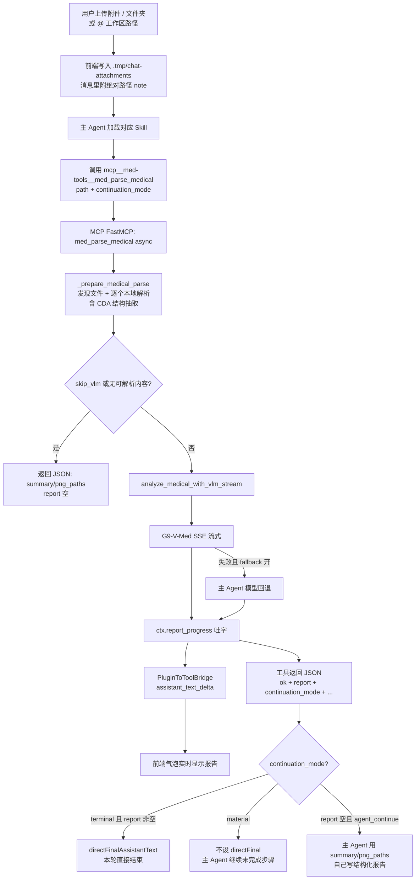
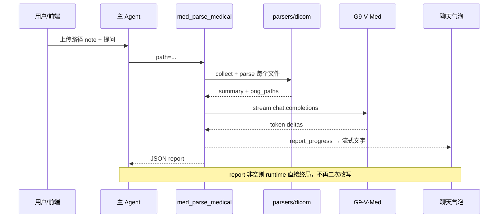
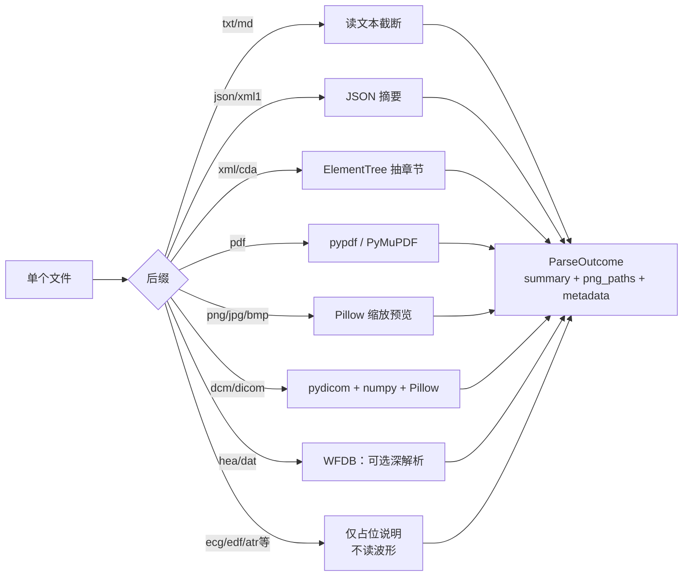

# `med_parse_medical` 文档解析与报告流程

> 对应 Skill：`med-medical`  
> 对应 MCP 工具：`mcp__med-tools__med_parse_medical`  
> 主要代码：`plugins/med-tools/server/app.py`、`parsers.py`、`dicom_parse.py`、`vlm_client.py`

本文说明从用户上传医学附件，到本地解析、G9-V-Med 流式出报告、以及按 `continuation_mode` 决定「本轮终局」还是「继续主 Agent」的完整链路。

---

## 1. 总览

工具做两件事：

1. **本地解析**：按后缀抽取摘要 / 元数据 / 预览图；CDA 走结构化抽取（CLUSTER 化验项、observation 配对）
2. **VLM 报告**：把摘要 + 预览图送给 G9-V-Med（失败可回退到 `pilotdeck.yaml` 配置的主 Agent 模型），流式直出到聊天

Skill 本身不解析文件，只规定何时调工具、传什么 `continuation_mode`。


| 层                             | 作用                                                          |
| ----------------------------- | ----------------------------------------------------------- |
| `skills/med-medical/SKILL.md` | 纯解读：`continuation_mode=terminal`；如何对待 `report`              |
| `skills/med-case-report/...`  | 多步骤：`continuation_mode=material`；解析后继续写模版/HTML               |
| `plugin.json`                 | 注册 MCP server `med-tools`、VLM/Embedding 环境变量                |
| PilotDeck AgentLoop           | 选 Skill → 调 MCP → 收到 progress / 最终 JSON                     |
| `PluginToToolBridge`          | 流式映射到气泡；仅在 `terminal` 且 `ok+report` 时设 `directFinalAssistantText` |


---


## 2. Skill 边界

`med-medical` 专注**附件解析与结构化报告**。相邻 Skill：


| 场景        | Skill                   | 工具 / 模式                                      |
| --------- | ----------------------- | --------------------------------------------- |
| 医学附件解读    | `med-medical`           | `med_parse_medical` + `terminal`              |
| 病例报告 / HTML | `med-case-report`     | `med_parse_medical` + `material` → 主模型续写     |
| 战创伤知识点问答  | `med-trauma-assist`     | `med_trauma_rag_query`                        |
| 正式六阶段救治方案 | `med-trauma-stage-plan` | 可选 `material` parse → `med_trauma_stage_plan` |


Agent 展示规则（摘要）：

- `continuation_mode=terminal` 且 `report` 非空：已流式展示并由 runtime 保存为最终答案，**不要再粘贴或改写**
- `continuation_mode=material` 且 `report` 非空：报告是后续步骤的材料，**不要复述全文**，继续未完成的计划项
- `report` 空且 `agent_continue=true`：主 Agent 用 `summary` / `png_paths` 继续写结构化报告，并说明 G9 不可用

---


## 3. 端到端：输入 → 输出




### 时序图




---


## 4. 本地解析详细步骤

入口：`app.py` → `_prepare_medical_parse` → `parsers.collect_medical_files` + `parse_medical_file`。

### 4.1 路径与发现

1. `path` 解析为绝对路径（文件或目录）
2. 派生目录：`{锚点}/.med-tools-derived`（或环境变量 `MED_DICOM_DERIVED_DIR` / `MED_DERIVED_DIR` 覆盖）
3. 目录：`rglob` 收集支持后缀，最多扫描约 512，实际解析 **≤ max_items（默认 64）**
4. 跳过隐藏文件与 `.med-tools-derived` 自身


### 4.2 按后缀分支（`parse_staged_file`）




### 4.3 各类型做什么


| 类型                                                          | 主要逻辑                                                                                                                                                               | Python 包                  |
| ----------------------------------------------------------- | ------------------------------------------------------------------------------------------------------------------------------------------------------------------ | ------------------------- |
| 文本 `.txt/.md`                                               | 读文件，截断约 6k 字进 summary；磁盘可留更长 preview                                                                                                                               | 标准库                       |
| JSON `.json/.xml1`                                          | 解析 JSON，列 top keys / 截断正文                                                                                                                                          | `json`                    |
| XML/CDA                                                     | `ClinicalDocument` 走 `cda_parser.py`：CLUSTER 化验项配对（优先 `检验结果代码` CD code）、observation 键值、BATTERY 血压等；非 CDA XML 仍用章节/叙述摘要。`status` 按结构化抽取质量判定，不因缺少 lxml 一律 degraded | 标准库 ElementTree；可选 lxml |
| PDF                                                         | **三条路（见下）**：先抽文本，抽不到再渲页图                                                                                                                                           | **pypdf**、**pymupdf**（可选） |
| 普通图                                                         | Pillow 限制长边 ≤1600，写出派生 PNG 供 VLM                                                                                                                                   | **Pillow**                |
| DICOM                                                       | `pydicom` 读元数据；像素 → numpy 窗宽/归一化 → Pillow 存 PNG；均匀抽帧 ≤`max_frames`                                                                                                 | **pydicom、numpy、Pillow**  |
| WFDB `.hea`（常配 `.dat`）                                      | **唯一较完整的心电路径**：可读头；安装 `wfdb` 时可 `rdrecord` 并可选渲波形 PNG。单独 `.dat` 多为配套占位（`included=False`），指望同名 `.hea`                                                               | **wfdb**（可选）、numpy、Pillow |
| 其他心电后缀 `.ecg` / `.wfdb` / `.atr` / `.qrs` / `.edf` / `.scp` | **不做内容解析**：不读文件字节、不抽波形、不渲图。仅按扩展名生成固定说明性 `summary`（如「心电相关文件（EDF）；当前仅支持 aECG XML 与 WFDB .hea/.dat 深度解析」），`status=degraded`、`included=False`。白名单能「收进目录」，**不等于能解读心电图** | —                         |


单文件失败不会拖垮整批：该条 `degraded/error`，其它文件继续。

**PDF 解析（**`_parse_pdf`**）——分三条路：**

不是把整份 PDF 原文件丢给 G9，而是本地先变成「文字摘要」或「少量页预览图」：

```text
打开 PDF
  │
  ├─① 用 pypdf 抽文本（最多约前 50 页）
  │     成功有字 → subtype=pdf_text、status=ready
  │     → summary 含截断正文 → 一般只把文本给模型（不传整 PDF）
  │
  ├─② 若①没字/失败，再用 PyMuPDF(fitz) 抽文本（同样最多约 50 页）
  │     成功有字 → 同上，文字 summary
  │
  └─③ 若仍完全没字（典型扫描件）
        用 PyMuPDF 把前最多 3 页渲成 PNG（dpi=144）
          → subtype=pdf_scanned、status=degraded
          → summary 写「扫描版 PDF，已渲 N 页预览；无可注入文本层」
          → 这几张 PNG 进 model_image_refs，VLM 以 image_url 看图
        若连渲染也失败 / 未安装 PyMuPDF
          → subtype=pdf_unreadable：几乎只有页数等说明，模型看不到正文
```

要点：

- **文字型 PDF**：优先可检索文本；模型主要吃 summary 里的字，不是多模态「翻完整本 PDF」。  
- **扫描型 PDF**：无 OCR；模型最多看**前 3 页截图**，靠视觉读字，效果受分辨率与页数限制。  
- 单文件进 summary 仍受约 6k 字截断；整包合并摘要约 12k 字硬顶。  
- **未接入**：复杂扫描件 / 表格密集报告若需更稳的 OCR 与版面，见文末 [§9 可选演进：MinerU](#9-可选演进mineru未接入)。

**心电（ECG）能力边界（避免误解）：**

- 后缀出现在下方白名单里，只表示可被 `collect_medical_files` 发现并走分支，**不代表系统已能很好解析各类 ECG**。  
- `.ecg/.edf/...`：**零内容解析**；说明句可能仍被拼进合并 `summary`，但**没有采样点、导联数据或波形图**，VLM **无法**据此做心电判读。  
- 真正可能给模型「有用心电信息」的，目前基本只有 **WFDB** `.hea`**(+**`.dat`**)**，且依赖可选包 `wfdb`；未安装或读失败时也会降级。  
- aECG XML 等在文案中被提及为「支持方向」，深度路径仍以代码里 WFDB 分支为准；不要默认「上传任意心电文件就能出专业心电图报告」。


### 4.4 合并进工具 payload

对每个文件拼一段：

```text
### 附件 i: name [kind/subtype] status=...
{summary}
```

再 `_cap_summary`：**整包合并摘要硬截断约 12,000 字**。  
所有预览 PNG 去重进 `png_paths`（**仅** `model_image_refs` 非空时才会有图；其他 ECG 占位分支此处为空）。

支持的后缀（`SUPPORTED_SUFFIXES`）——**收录 ≠ 深度解析**：

```text
.cda .xml .json .xml1 .txt .md .markdown .pdf
.png .jpg .jpeg .bmp .dcm .dicom
.ecg .wfdb .hea .dat .atr .qrs .edf .scp
```

其中心电相关：仅 `.hea`/`.dat` 有可选深解析；其余心电后缀见上表「占位说明」。

---


## 5. VLM 报告阶段

若未 `skip_vlm`，且 summary/png 不全空：

1. 读系统提示 `plugins/med-tools/prompts/medical_read.md`（证据化卡片：资料概况 / 初步判断 / 图像判读…）
2. `build_medical_user_content`：摘要文本 + 预览图 **base64 data URL**（有 `png_paths` 时才追加 `image_url`；**其他 ECG 占位无预览图，不会走多模态看波形**）
3. `httpx` 调 OpenAI 兼容接口：
  - 主：`MED_VLM_API_BASE`（如济南 G9 `http://10.31.112.13:8030/v1`）  
  - 备：`MED_VLM_FALLBACK_*`（未设置时读 `pilotdeck.yaml` 的 `agent.model` 及对应 provider）
4. **流式**：SSE delta → `on_text` → `ctx.report_progress` → 前端气泡
5. 最终 JSON：`report`、`ok`、`vlm_ok`、`fallback_used`、`agent_continue`、`png_paths`、`summary`、`items`…

运行时若 `ok && report`：报告已流式展示并直接作为最终助手消息，**Agent 不应再改写粘贴**。

因此：模型实际吃到的是「本地解析产出的 text summary ± 派生预览图」，**不是**原始 `.dcm`/PDF/心电二进制。心电若只有 `.edf` 等占位附件，报告里即便提到该文件，也**缺乏真实波形依据**。

报告卡片结构（提示词约定）大致为：

1. 【资料概况】
2. 【初步判断】
3. 【图像判读】
4. 【可见证据 / 文本要点】
5. 【推理依据】
6. 【可能情况 / 鉴别诊断】
7. 【风险提示】
8. 【下一步建议】
9. 免责声明

---


## 6. 依赖包一览（`requirements.txt`）


| 包                 | 角色                                                                              |
| ----------------- | ------------------------------------------------------------------------------- |
| **mcp** (FastMCP) | MCP 工具服务                                                                        |
| **httpx**         | 调 G9 / 主 Agent 回退模型 /（RAG 时）embedding                                                    |
| **pydicom**       | DICOM                                                                           |
| **Pillow**        | 图像缩放、DICOM/PDF/WFDB 预览 PNG                                                      |
| **numpy**         | DICOM 像素、WFDB 波形                                                                |
| **pypdf**         | PDF 文本                                                                          |
| **pymupdf**（可选）   | PDF 无文本时渲页                                                                      |
| **wfdb**（可选）      | **仅** WFDB `.hea`/`.dat` 深解析；未安装则心电能力进一步降级。`.ecg/.edf/...` 不依赖此包，因为那些后缀当前不做内容解析 |


缺可选包 → 该分支 `degraded`，其它类型仍可用。可用 `med_tools_health` 检查依赖与 VLM 可达性。

---


## 7. 输入 / 输出契约


### 输入（工具参数）


| 参数           | 说明                     |
| ------------ | ---------------------- |
| `path`       | 文件或目录绝对路径（主）           |
| `max_items`  | 目录最多解析个数（默认/上限 64）     |
| `max_frames` | DICOM/图像采样（默认 8，硬顶 32） |
| `skip_vlm`   | 只解析不调模型                |


### 输出（JSON 要点）


| 字段               | 说明                                         |
| ---------------- | ------------------------------------------ |
| `items[]`        | 每文件 kind/status/summary/metadata/png_paths |
| `summary`        | 合并摘要（≤~12k 字）                              |
| `png_paths`      | 派生预览绝对路径                                   |
| `report`         | 结构化中文报告（流式同源）                              |
| `ok` / `vlm_ok`  | 是否有可用报告 / VLM 是否成功                         |
| `fallback_used`  | 是否走了主 Agent 模型回退                                |
| `agent_continue` | 是否需要主 Agent 续写                             |
| `warnings`       | 截断、缺依赖、单文件失败等                              |


---


## 8. 相关文件索引


| 路径                            | 内容                   |
| ----------------------------- | -------------------- |
| `skills/med-medical/SKILL.md` | Agent 路由与展示规则        |
| `server/app.py`               | MCP 工具入口、流式 progress |
| `server/parsers.py`           | 多源本地解析               |
| `server/cda_parser.py`        | CDA ClinicalDocument 结构抽取 |
| `server/dicom_parse.py`       | DICOM 专用解析           |
| `server/vlm_client.py`        | G9 / 主 Agent 回退调用与流式       |
| `prompts/medical_read.md`     | 报告系统提示词              |
| `plugin.json`                 | MCP 与环境变量            |
| `requirements.txt`            | Python 依赖            |


---


## 9. 可选演进：MinerU（未接入）

> **现状：** 仓库与 `requirements.txt` **未依赖、未调用** [MinerU](https://github.com/OpenDataLab/MinerU)。本节仅作能力对照与产品演进备忘，**不是当前实现**。


### 9.1 MinerU 是什么

OpenDataLab 开源的文档解析引擎：把复杂 PDF（多栏、表格、扫描件、公式等）转成适合 LLM/RAG 的 **Markdown + JSON**，而不只是「抠一段纯文本」或「渲几页图给 VLM 看」。

相对当前 `_parse_pdf` 三条路：


|         | 当前（pypdf / PyMuPDF）       | MinerU                                      |
| ------- | ------------------------- | ------------------------------------------- |
| 定位      | 轻量预处理                     | 完整文档理解管线                                    |
| 文字 PDF  | 抽文本层，快                    | 也可读原生文本，并整理版面/阅读顺序                          |
| 扫描 PDF  | 无 OCR；最多前 3 页 PNG 靠 G9 看图 | **OCR + 版面**，输出可读 Markdown                  |
| 表格 / 多栏 | 弱（字挤在一起或靠看图）              | 专门做表结构与阅读顺序                                 |
| 输出进本工具  | 截断 summary ± 少量预览图        | 理想形态：Markdown **截断进 summary**，再交给现有 G9 报告链路 |


MinerU **不替代** G9 写报告，也不覆盖 DICOM / WFDB / 心电专用格式；只可能改善 **PDF（尤其是扫描与复杂版式）喂给模型的原料质量**。

### 9.2 后端选型（若以后评估）


| Backend                 | 思路                  | 准确率量级¹                     | 纯 CPU    | 本地 GPU     | 备注                                         |
| ----------------------- | ------------------- | -------------------------- | -------- | ---------- | ------------------------------------------ |
| **pipeline**            | 检测 + OCR + 表/公式等流水线 | ~86.5                      | ✅        | 可选（约 ≥4GB） | **最轻一档、无幻觉倾向**；仍比 pypdf 重一个数量级             |
| **hybrid-engine**（官方默认） | 原生文本 + 必要时 OCR/VLM  | ~95.3（medium）/ ~95.4（high） | ❌        | 约 ≥8GB     | 文字 PDF 幻觉低；`effort=medium|high` 控速度/是否做图分析 |
| **vlm-engine**          | 以视觉语言模型为主           | ~95.3                      | ❌        | 需要         | 依赖 vLLM / LMDeploy / mlx 等                 |
| **-http-client**        | 本机薄客户端，模型在远端        | 同对应 engine                 | ✅（算力在远端） | 在服务端       | 适合「插件机轻、GPU 机重」拆分                          |


¹ OmniDocBench v1.6 端到端 Overall（官方 README 量级，随版本变化）。

资源量级（官方 Quick Start）：pipeline / 本地 engine 常见 **内存 ≥16GB（建议 32GB+）**、**磁盘 ≥20GB（模型，SSD）**；http-client 本机磁盘可更小。费用形态是 **部署体积 + 机器规格 + 单文档耗时/并发**，不是按页 API 计费。

相对当前方案：**pipeline 已是 MinerU 里最便宜的，但仍远重于「抽文本 / 渲三页」**；hybrid 更准，账单主要是 GPU。

### 9.3 若接入本流程的建议形态（仅设计备忘）

```text
PDF 入
  → 仍先走现有 ①②（pypdf / PyMuPDF 文本）
  → 仅当「无文本 / 文本极少 / 明确扫描」时
        可选：调 MinerU（优先 pipeline，或远端 hybrid）
        → 将 Markdown 截断写入 summary（受现有 ~6k / 整包 ~12k 约束）
        → 再进入现有 analyze_medical_with_vlm_stream（G9）
  → 默认路径不替换；不把 MinerU 当报告生成器
```

产品上：**文字型 PDF 继续默认当前三条路**；仅扫描/低文本场景再评估按需触发。勿默认全量 hybrid，也勿指望 MinerU 解析 ECG/DICOM。

官方入口：[GitHub OpenDataLab/MinerU](https://github.com/OpenDataLab/MinerU)、[Quick Start](https://opendatalab.github.io/MinerU/quick_start/)。

---


## 10. 一句话总结

Skill 只负责路由；真正干活的是插件里「按后缀本地解析（含结构化 CDA）→ 拼摘要与预览图 → G9 流式出报告 → 按 `continuation_mode` 决定终局或续跑」。  
**注意：** 后缀白名单里的心电格式多数仍是占位；不要理解为系统已能完善解析各类 ECG。PDF 扫描件当前无 OCR；MinerU 仅作可选演进备忘，**尚未接入**。