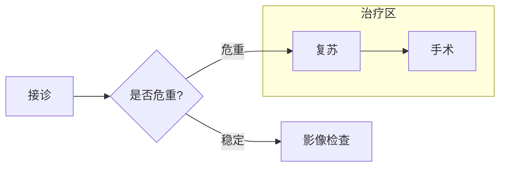

# 创建图示

生成图示前阅读本文。Agent 只描述节点、边和分组；不要编写 SVG、HTML 或
Excalidraw 元素数组。

## 固定流程

- 新建图示只使用 `diagram.sh make`。
- 短线性流程使用 `--title` + `--body`。
- 分支流程使用 `--markdown` Mermaid 子集。
- 架构节点、分组和语义类型使用 `--spec` JSON。
- 默认输出 `.svg`；覆盖必须加 `--force`。

## Mermaid 子集



支持 `flowchart` / `graph`，方向 `LR` / `RL` / `TB` / `TD`，以及简单 `subgraph`。

节点形状：

- `id[文本]`、`id["带引号文本"]`、`id(文本)`：普通步骤
- `id{文本}`：判断节点，渲染成菱形
- `id{{文本}}`：数据存储

连线：`-->`、`---`、`-.->`（虚线）、`==>`。边标签两种写法都可以，
`A -->|标签| B` 和 `A -- 标签 --> B` 等价。

标签内换行用 `<br/>`，或直接在方括号里换行书写，两者都会自动重排。
标签过长会自动折行，最多三行。

不支持的 Mermaid 图类型会返回 `invalid-diagram-input`；不要改成手写 SVG。

## JSON spec

```json
{
  "title": "离线医疗文档链路",
  "direction": "LR",
  "theme": "architecture",
  "nodes": [
    { "id": "input", "label": "医学附件", "kind": "input" },
    { "id": "parser", "label": "本地解析", "kind": "service", "group": "local" },
    { "id": "store", "label": "结构化结果", "kind": "database", "group": "local" },
    { "id": "report", "label": "报告", "kind": "process" }
  ],
  "edges": [
    { "from": "input", "to": "parser" },
    { "from": "parser", "to": "store", "label": "抽取" },
    { "from": "store", "to": "report" }
  ],
  "groups": [
    { "id": "local", "label": "离线处理", "nodes": ["parser", "store"] }
  ]
}
```

节点 `kind` 支持：

- `neutral`
- `input`
- `process` / `service`
- `decision`（菱形判断）
- `storage` / `database` / `queue`
- `external`
- `risk`

边可选 `"style": "dashed"`。节点和分组 `id` 只能使用英文字母、数字、
下划线和连字符，且不能以数字开头。

## 输出格式

- `--format svg`：默认，也是聊天预览和下载的主路径。
- `--format html`：只在用户明确要独立网页时使用；输出是无脚本、无远程资源
  的单文件 HTML。

不要用 HTML 代替 SVG 作为普通交付物。
